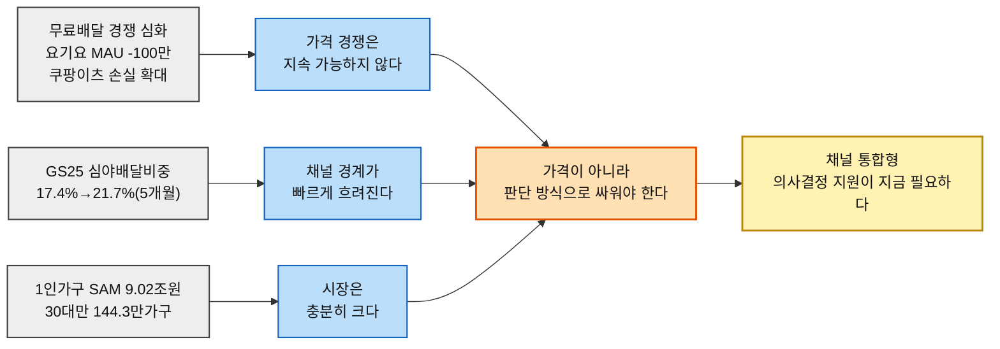
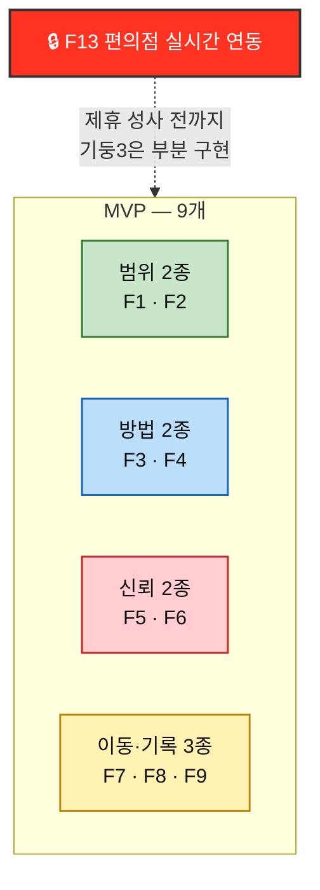

# Value Proposition — 한끼라우터 (1인 가구 한 끼 해결 플랫폼)

> **입력** [챕터 04 TAM-SAM-SOM §08](../../04.tam-sam-som/1인가구한끼해결-7단계/08-TAMSAMSOM단계별대응구조.md)·[§09 마켓세그먼트맵](../../04.tam-sam-som/1인가구한끼해결-7단계/09-마켓세그먼트맵.md)·[§07 SRS](../../04.tam-sam-som/1인가구한끼해결-7단계/07-솔루션구체화-SRS.md) · [챕터 05 페르소나 스펙트럼](../../05.persona-journey-map/1인가구한끼해결-페르소나여정/02-페르소나스펙트럼.md)·[고객여정지도](../../05.persona-journey-map/1인가구한끼해결-페르소나여정/06-고객여정지도-종합판.md) · [챕터 06 AOS](../../06.market-opportunity/1인가구한끼해결-시장기회분석/02-AOS매트릭스.md)·[DOS](../../06.market-opportunity/1인가구한끼해결-시장기회분석/03-DOS매트릭스.md)·[혼합매트릭스](../../06.market-opportunity/1인가구한끼해결-시장기회분석/04-AOSxDOS-혼합매트릭스.md) · [챕터 07 JTBD 결과](../../07.jtbd/1인가구한끼해결-jtbd/03-JTBD결과보고서.md) · [챕터 08 경쟁 분석](../../08.competitor-branding/1인가구한끼해결-경쟁사분석/01-경쟁사-가치선언-분석.md)·[가치목표 제안](../../08.competitor-branding/1인가구한끼해결-경쟁사분석/02-차별적가치목표-제안.md)
>
> ⚠️ **근거 등급이 항목마다 다르다.** §4 기존 대안과 §7-2의 시장·경쟁 통계는 **(확인 · 외부/내부 실측)**, §1~§3의 Pain·Job·Outcome은 **(가정 · 실제 인터뷰 미실시)**다. 상세는 §9.

---

## 서비스 정의 — 한 문단

**오늘 한 끼의 예산·시간·취향을 입력하면 배달·포장·편의점-HMR 중 가장 적합한 경로를 정규화해 보여주는 의사결정 서비스**를 운영한다. 주문·결제·배차는 하지 않으며, **직접 판매하는 것은 음식이 아니라 "오늘 가진 돈과 시간 안에서 가장 납득되는 선택"이라는 판단**이다. 성과 단위는 `조건 입력 → 3개 추천 카드 → 외부 채널 이동`이며, PoC 핵심 지표는 결정시간·선택 총비용의 단축이다.

---

# 1. 페르소나 및 CJM 기반 고객별 핵심 문제 (Pain · Needs)

## 1-1. 여정의 공통 구조 — 병목은 후보비교 단계에 집중된다

12개 페르소나의 7단계 여정을 겹쳐 보면, 이탈·정체가 **③후보비교**(비교 자체가 반복·불신·다양성 결핍으로 막힘)와 **①오늘의갈등**(트리거 자체가 발생하지 않거나 방치됨) 두 곳에 집중된다.

> 📌 **④외부이동(원 서비스로 이동)은 여정의 끝이 아니라 중간이다.** 가치가 실제로 전달되는 지점은 그 이후(⑤~⑥)이며, 우리 서비스가 직접 통제하지 못하는 구간이 시작되는 지점도 여기다.

## 1-2. 인물별 핵심 Pain

| 인물 | 스펙트럼 | 핵심 Pain | 병목 단계 |
| --- | :---: | --- | :---: |
| **C1**「퇴근을 예측할 수 없다」 | 🔵 핵심 | **P01** 매번 같은 고민이 반복된다 · **P02** 갱신시각 지난 정보에 대한 불신 | ②~③ |
| **C2**「마감엔 다 필요없다」 | 🔵 핵심 | **P04** 마감과 식사 결정이 겹친다 | ① |
| **C3**「매일이 곧 지출이다」 | 🔵 핵심 | **P07** 방치될수록 누적 지출이 커진다 · **P09** 지출 누적을 확인 전까지 심각성을 못 느낀다 | ①·⑥ |
| **C4**「기운이 없는데 골라야 한다」 | 🔵 핵심 | **P10** 지친 상태에서 결정을 요구받는다 | ② |
| **C5**「둘 다 없다」 | 🔵 핵심 | **P13** 예산·시간 동시압박, 기준을 못 잡는다 | ②~③ |
| **A1**「1인분은 손해다」 | 🟢 확장 | **P16·P17** 최소주문금액 걱정, 1인분 필터 부재 | ③ |
| **A2**「또 그 메뉴다」 | 🟢 확장 | **P20** 추천이 매번 비슷해 다양성이 해결 안 된다 | ③ |
| **A3**「같이 살아도 혼자 먹는다」 | 🟢 확장 | **P22·P23** 앱이 나를 위한 게 맞는지 헷갈림, 1인가구 전제가 안 맞음 | ② |
| **X1**「새벽엔 문 닫은 도시」 | 🔴 극단 | **P25·P26·P27** 영업시간 자체가 벽, 커버리지 신뢰 부재, 후보 0건이면 여정 종료 | ②~③(존재론적 관문) |
| **X2**「지도 밖의 동네」 | 🔴 극단 | **P28·P29·P30** 신뢰 부재, 기대 안 함, 선택지 없어 비교 무의미 | ②~③ |
| **N1**「안 시켜도 괜찮다」 | ⬜ 비활성 | **P31** UX 개선으로도 애초에 앱을 안 연다 | ① 이전(트리거 부재) |
| **N2**「전화가 더 빠르다」 | ⬜ 비활성 | **P32** 앱이라는 형식 자체가 진입장벽이다 | ① 이전(트리거 부재) |

## 1-3. 32개 Pain을 관통하는 Need

| 발견 | 내용 |
| --- | --- |
| **불편이 아니라 "선택의 반복"** | 다수(P01·P04·P10·P13)가 "한 번 정하면 끝나는 게 아니라 매일 새로 정해야 한다"는 구조적 피로에서 나온다 |
| **최상위권은 "대체재가 아예 없는" 자리** | AOS 최상위(X1·X2의 야간·지역 커버리지, [02-AOS매트릭스.md §5-1](../../06.market-opportunity/1인가구한끼해결-시장기회분석/02-AOS매트릭스.md))는 더 잘 추천해서 이기는 문제가 아니라 시장에 없는 것을 만드는 문제다 |
| **Non-user(N1·N2)는 트리거 자체가 발생하지 않는다** | 앱을 열지 않는 이유가 UX 문제가 아니라 신뢰·습관 문제라는 것이 [06-고객여정지도-종합판.md](../../05.persona-journey-map/1인가구한끼해결-페르소나여정/06-고객여정지도-종합판.md)에서 이미 확인됐다 |

---

# 2. JTBD 관점 — 고객 상황별 Goal · Job

> [챕터 07 JTBD 요약 카드](../../07.jtbd/1인가구한끼해결-jtbd/03-JTBD결과보고서.md §1)에서 추출. **07챕터가 두 기준(핵심·확장 그룹 ∩ 최우선·니치마켓 사분면)의 교집합으로 좁힌 C1·C3·A2 3인만 실제 JTBD 인터뷰(모의) 대상**이다 — §1의 12인 중 나머지는 아직 JTBD 단계로 넘어가지 않았다.

| # | 인물 | Situation (When…) | **Job Statement (…I want to…)** |
| :---: | --- | --- | --- |
| **J1** | C1 | 야근으로 퇴근 시각이 언제인지도 모를 때 | 세 개 앱을 돌려가며 고민하지 않고, 한 끼를 **즉시 확정하고자** 함 |
| **J2** | C3 | 퇴근하고 요리할 힘이 하나도 없을 때 | 생각 없이 그냥 시키고 싶지만, 그러면서도 **지출은 늘리지 않고자** 함 |
| **J3** | A2 | 배달앱을 켜도 뭘 볼지 뻔하게 느껴질 때 | 뭔가 **새로운 것을 발견하고자** 함 |

> 🎯 **세 Job의 동사가 정반대 방향으로 갈린다.** J1·J2는 "확정하다·억제하다" — **애쓰지 않아도 되는 상태**를 원한다. J3는 "발견하다" — **적극적으로 더 애써주길** 원한다. 같은 서비스가 "덜 생각하게 해주는 것"과 "더 다양하게 보여주는 것"을 동시에 만족시켜야 한다는 뜻이며, 이 둘은 설계상 긴장 관계다(정보를 줄이면 J1·J2에 좋고 J3엔 나쁘다).
>
> ⚠️ **J3는 실제로 가장 약하게 확인됐다.** [챕터 07 §5-3](../../07.jtbd/1인가구한끼해결-jtbd/03-JTBD결과보고서.md)은 A2가 데모를 보고도 *"지금 상태로는 안 그만둘 것 같다"*고 스스로 밝혔다고 기록한다 — Push는 있지만 Pull이 없는 상태다. **J3를 J1·J2와 같은 비중으로 설계 우선순위에 두면 안 된다.**

---

# 3. 고객이 원하는 Outcome

> **측정 가능한 형태**로 서술한다. `📏`는 모의 인터뷰에서 구체적 수치가 확보된 항목. DOS(SAM) 내림차순.

| # | Outcome | 인물 | Imp | Sat | **AOS** | **DOS**(SAM) | DOS(SOM) | 측정 표현 |
| :---: | --- | :---: | :---: | :---: | :---: | :---: | :---: | --- |
| **O01** | 반복 결정 없이 즉시 확정 | C1 | 5 | 2 | 3.0 | **0.60** | 2.70 | 📏 비교에 **15분** 소요 → 목표 즉시 |
| **O02** | 누적 지출을 확인해 통제(대시보드) | C3 | 4 | 1 | 3.2 | **0.60** | 1.80 | 예산 초과 0건 *(목표치 미확정)* |
| **O03** | 과거 추천 정확도 이력을 근거로 신뢰 | C1 | 3 | 1 | 2.4 | **0.40** | 1.80 | 이력 확인 횟수 *(미확정)* |
| **O04** | 화면 정보를 재확인 없이 신뢰 | C1 | 4 | 2 | 2.4 | **0.40** | 1.80 | 원 서비스 재확인율 *(미확정)* |
| **O05** | 지출이 쌓이는 것을 미리 인지·조절 | C3 | 4 | 2 | 2.4 | **0.40** | 1.20 | *(미확정)* |
| **O06** | 예산 확인이 자동으로, 새 숙제 없이 | C3 | 3 | 1 | 2.4 | **0.40** | 1.20 | *(미확정)* |
| **O07** | 조건 재입력 없이 최근 조건 기억 | C1 | 3 | 2 | 1.8 | **0.20** | 0.90 | *(미확정)* |
| **O08** | 매번 다른 선택지를 추천 | A2 | 3 | 2 | 1.8 | **0.13** | 0.00 | 미시도 옵션 비율 *(미확정)* |

> ⚠️ **측정 표현이 붙은 것은 8개 중 1개(O01)뿐이다.** 나머지 7개는 *"몇 분·몇 %·몇 건"*이 비어 있고, 그 빈칸이 실제 인터뷰에서 반드시 받아 와야 할 목록이다([챕터 07 §2 📌](../../07.jtbd/1인가구한끼해결-jtbd/03-JTBD결과보고서.md)).
>
> 🔻 **O08은 이 문서 작성 과정에서 한 차례 하향 재판정됐다** — 원래 AOS 2.4였으나 모의 인터뷰의 어조(지루함 ≠ 고통)를 근거로 1.8로 낮췄다(§7-4에서 반증으로 다시 기록).

---

# 4. 기존 대안 (Competitor / Substitute)

> [챕터 08 경쟁 분석](../../08.competitor-branding/1인가구한끼해결-경쟁사분석/01-경쟁사-가치선언-분석.md) · 규모는 각 기업 공식 발표·언론 보도 기준 · **(확인)**

| 서비스 | 경쟁 축 | 규모 | 가치 선언 *(활동에서 역산)* |
| --- | :---: | --- | --- |
| **배달의민족** | ① 배달채널 | MAU 2,375만(1위), 매출 5조2,829억원(+22%) | *"1인분이라도, 전국 어디서든, 소외되지 않는 한 끼를"* |
| **쿠팡이츠** | ① 배달채널 | MAU 1,316만(+26%), 연간손실 9.95억달러로 확대 | *"얼마를 시키든, 배달비 걱정 없이"* |
| **요기요** | ① 배달채널 | MAU 418만(1년새 -100만), 업계 3위 | *"가장 싼 곳이 아니라, 가장 즐거운 한 끼를"* |
| **두잇** | ① 배달채널(니치) | 서울 5개구 한정, 가입자 120만 | *"혼자여도, 먹고 싶은 만큼만, 가장 저렴하게"* |
| **배달핏** | ② 배달앱 간 조건비교 | 회사 실체 확인 불가, 웹사이트 기반 | *"어떤 배달앱 편도 들지 않고, 가장 싼 선택지를"* |
| **GS25** | ③ 분리된 채널 | 편의점 매출 약 8조9,396억원, 심야배달비중 21.7%(2026.4) | *"24시간보다 더 큰 가치로, 우리 동네의 모든 순간을"* |

> 🚨 **우리는 세 개 축에서 동시에 신생이다.** 각 축에 이미 강자가 있고, 규모·제도·데이터 어느 것도 앞서지 않는다.
>
> ⚠️ **'무료배달'은 이미 레드오션이다.** 배민·쿠팡이츠·두잇 셋 다 가격을 브랜드 축으로 잡았다. 가격을 선언하는 것만으로는 차별화가 생기지 않는다.

---

# 5. 우리 솔루션의 핵심 제안 (Value Proposition)

> ## **"오늘 가진 돈과 시간 안에서, 가장 납득되는 한 끼를 더 빨리 고르게 합니다.**
> ## **누구의 편도 아니고, 어느 채널에도 갇히지 않습니다."**

### 이 문장이 성립하는 이유

| 절 | 대응 기둥 | 경쟁 공백 |
| --- | --- | --- |
| *"오늘 가진 돈과 시간 안에서"* | **범위 — 채널을 넘나드는 단일 기준** | 배달 4사는 배달 채널 내부, 배달핏은 배달앱 간 조건만. 세 채널(배달·포장·편의점)을 하나의 기준으로 비교하는 곳은 없다 |
| *"가장 납득되는… 더 빨리"* | **방법 — 가격·시간 동시 최적화** | 6개사 전부 단일 축(가격 또는 즐거움 또는 채널편의)에 머문다. 가격과 시간을 동시에, 임의 가중치 없이 반영하는 추천은 없다 |
| *"누구의 편도 아니고"* | **신뢰 — 이해관계 없는 판단** | 배달 4사는 자기 채널 매출에 이해관계가 있고, 배달핏의 중립성은 배달앱 3사에 갇혀 있다 |

> 📌 **세 절이 서로 대체 불가능한 필요조건이다.** 하나를 빼면 문장의 그 부분이 곧바로 거짓이 된다([08번 문서 §2](../../08.competitor-branding/1인가구한끼해결-경쟁사분석/02-차별적가치목표-제안.md)의 제거 논증).

---

# 6. 우리가 제공하는 차별적 가치

## 6-1. 세 방향

| 기둥 | 선언 *(공개 약속형)* | 청중 | 지금 실행 가능? |
| --- | --- | --- | :---: |
| **1. 신뢰**(이해관계 없는 판단) | *"추천 순서와 필터링 로직에 채널·업체별 차등을 두지 않습니다."* | 반복 이용자(C1형), 신뢰 축적이 전환의 조건인 사람 | ⏳ 설계 원칙은 지금, **대외 선언은 수익모델 확정 후** |
| **2. 방법**(가격·시간 동시 최적화) | *"가격 40%, 시간 30%식 가중치 없이, 두 조건을 동시에 만족하는 선택만 남깁니다."* | 전체 사용자, 특히 C1·C3 | ✅ **오늘 가능**(SRS Pareto로 이미 완성) |
| **3. 범위**(채널을 넘나드는 단일 기준) | *"배달·포장·편의점을 같은 총비용·총시간 기준으로 비교합니다."* | 전체 사용자 + 편의점 대체 이용군 | ✅ 선언은 오늘 가능, **구현은 부분적**(편의점 데이터 제휴 전) |

## 6-2. 세 방향은 같은 약점을 뒤집은 것이다

| 기둥 | 우리 약점 | 뒤집힌 결과 |
| --- | --- | --- |
| **1(신뢰)** | 수익모델이 아직 없다 | **그래서 지금은 완전히 중립적이다** — 수익원이 없으니 편향될 유인 자체가 없다 |
| **2(방법)** | 없음 — 이미 SRS 설계로 충족 | 약점 없이 바로 강점 |
| **3(범위)** | 편의점 실시간 데이터를 우리가 소유하지 않는다 | **그래서 어느 채널에도 종속되지 않은 재가공자로 포지셔닝할 수 있다** |

> 🎯 **셋 다 "우리가 덜 가진 것"을 강점으로 뒤집는 구조다.** 경쟁사들이 자기 채널·자기 데이터를 키워 우위를 만드는 동안, 우리는 아무것도 소유하지 않았다는 사실 자체를 신뢰의 근거로 쓴다.

---

# 7. Proof

## 7-1. 고객가치 도출의 근거 — 여섯 경로가 같은 곳을 가리켰다

| 경로 | 산출물 | 지목한 것 |
| --- | --- | --- |
| **① 페르소나 스펙트럼** | C1·C3가 핵심(Core) 그룹에서 반복결정·지출 문제로 정의됨 | 즉시확정 · 지출가시화 |
| **② 고객여정지도** | 병목이 ②조건설정~③후보비교(C1), ①오늘의갈등~⑥소비피드백(C3)에 집중 | 반복적 판단 부담 |
| **③ AOS** | P01(3.0)이 전체 2위권, P07·P09·P20 각 2.4로 6위권 동률 | 즉시확정 최우선 |
| **④ DOS(SOM)** | O01(2.70)·O02(1.80)이 1년차 검증 순서 1·2위 | 즉시확정 + 지출가시화 |
| **⑤ JTBD 모의인터뷰** | C1·C3는 재확인+구체화(정확도 이력·지출 대시보드 신규 발굴), A2는 오히려 약화 | 같은 결론 재확인 |
| **⑥ 경쟁사 조사** | 6개사 누구도 채널통합+가격시간 동시최적화 선언 안 함, GS25만 P26 부분 해결 | 공백 실증 |

> 🎯 **모수 선택(SAM/SOM)도, 분석 방법(정량 채점/모의 인터뷰/경쟁 실사)도 이 결론을 바꾸지 못했다.** 반면 한때 AOS 최상위였던 P26(X1 커버리지)은 경쟁조사에서, O08(A2 다양성)은 JTBD 인터뷰에서 각각 흔들렸다 — **이 대비가 C1·C3 기회의 견고함을 보여준다**(§7-4).

## 7-2. 시급성 근거 — 시장·경쟁 통계 (확인)

| 층 | 지표 | 출처 |
| --- | --- | --- |
| **시장 규모** | 1인가구 배달·포장 SAM 9.02조원(전 연령), 30대 1인가구 144.3만가구(2025) | [04장 §08](../../04.tam-sam-som/1인가구한끼해결-7단계/08-TAMSAMSOM단계별대응구조.md) |
| **경쟁 압박 심화** | 요기요 MAU 1년새 100만명 감소(2026.3, 513만→418만), 쿠팡이츠 연간손실 6.31억→9.95억 달러로 확대 | [08장 §1](../../08.competitor-branding/1인가구한끼해결-경쟁사분석/01-경쟁사-가치선언-분석.md) |
| **채널경계 침식 속도** | GS25 심야(22~03시) 배달비중 17.4%(2025.11)→21.7%(2026.4), 5개월 만에 4.3%p 상승 | [08장 §1](../../08.competitor-branding/1인가구한끼해결-경쟁사분석/01-경쟁사-가치선언-분석.md) |
| **소액주문 경쟁 격화** | 배민 한그릇 2주 만에 주문 123%↑ → 전국확대(2025.5), 쿠팡이츠 "하나만 담아도 무료배달"(2025.8)로 정면대응 | [08장 §2-1·2-2](../../08.competitor-branding/1인가구한끼해결-경쟁사분석/01-경쟁사-가치선언-분석.md) |

### 이 근거가 사업 논거로 직결되는 방식

## 7-3. 대안과의 차별성 비교

| 비교 축 | 배민 | 쿠팡이츠 | 요기요 | 두잇 | 배달핏 | GS25 | **한끼라우터** |
| --- | :---: | :---: | :---: | :---: | :---: | :---: | :---: |
| **신뢰(이해관계 없는 판단)** | ❌ | ❌ | ❌ | ❌ | ⚠️(배달앱 3사 한정) | ❌ | **✅** |
| **방법(가격·시간 동시최적화)** | ⚠️(가격만) | ⚠️(가격만) | ❌(즐거움) | ⚠️(가격만) | ⚠️(조건비교만) | ❌(편의성) | **✅** |
| **범위(채널 통합)** | ❌(배달만) | ❌(배달만) | ❌(배달만) | ❌(배달만) | ⚠️(배달앱 간) | ⚠️(편의점만, 제휴 확대중) | **✅** |
| **"세지 않겠다"(이해관계 무선언)** | ✖ | ✖ | ✖ | ✖ | ⚠️(부분) | ✖ | **✔(예정)** |

> 📌 **차별성은 새로운 일을 하는 데서 오지 않는다.** 여섯 경쟁사 각각은 이미 한두 축에서 강하다. **우리 자리는 세 축을 동시에 차지하는 유일한 지점**이며, 그중 "범위" 축은 GS25가 가장 먼저 위협할 수 있다.

## 7-4. 반증된 것도 함께 기록한다

| 항목 | 한때의 판정 | 반증 | 출처 |
| --- | --- | --- | --- |
| **P26 커버리지 신뢰 부재**(X1) | AOS **3.2, 공동 1위** | GS25의 24시간 운영+심야배달 확대(21.7%)가 부분적 대안 제공 → AOS **2.4**로 재판정 | [08장 §4-3](../../08.competitor-branding/1인가구한끼해결-경쟁사분석/01-경쟁사-가치선언-분석.md) |
| **O08 다양성 결핍**(A2) | AOS **2.4** | 모의 인터뷰 어조가 "고통"이 아니라 "지루함·체념"에 가까움 → AOS **1.8**로 하향 | [07장 §3-1](../../07.jtbd/1인가구한끼해결-jtbd/03-JTBD결과보고서.md) |

> 🎯 **반증을 남기는 것이 이 문서의 신뢰 근거다.** 한때 상위권이던 두 항목을 스스로 낮춘 기록이 있어야, 남아 있는 C1·C3 기회가 살아남은 것이라는 말에 무게가 실린다.

---

# 8. Job-Feature Map

## 8-1. 기능 명세

> **중요도** = AOS·DOS 순위 + 여정 병목 여부 · **난이도** = 개발·데이터 확보 난도 종합 · `🔒`는 **외부 데이터 제휴에 종속**된 기능

| 기능명 | 핵심 Job 연관성 | 중요도 | 난이도 | MVP | 우선순위 |
| --- | --- | :---: | :---: | :---: | :---: |
| **F1** 위치/예산/시간/취향 입력 | 모든 Job의 입력 전제 | **5** | 2 | ✔ | **High** |
| **F2** 배달·포장·편의점-HMR 옵션 정규화 | J1·J2·J3 공통 전제, 기둥3(범위) | **5** | 4 | ✔ | **High** |
| **F4** 추천 생성 — 절약/빠름/균형 3카드(Pareto) | J1(즉시확정), 기둥2(방법) 핵심 | **5** | 3 | ✔ | **High** |
| **F6** 추천 로직 노출순서 무차등(로그화) | 기둥1(신뢰)의 최소요건 | **5** | 2 | ✔ | **High** |
| **F11** 누적 지출 대시보드 *(JTBD 신규 발굴)* | J2(C3) — [07장 §3-3](../../07.jtbd/1인가구한끼해결-jtbd/03-JTBD결과보고서.md) 1순위 실험 | **5** | 3 | ✖ | **High** |
| **F3** 조건 필터(예산/시간/영업/최소주문) | 기둥2(방법) 1단계 | 4 | 2 | ✔ | High |
| **F5** 비교 상세 — 가격·시간 구성, 갱신시각 | O04, 기둥1(신뢰) | 4 | 2 | ✔ | High |
| **F12** 추천 정확도 이력 노출 *(JTBD 신규 발굴)* | J1(C1) 습관 이탈 조건, 기둥1(신뢰) | 4 | 4 | ✖ | Mid |
| **F13** 🔒 편의점 재고 실시간 연동 | 기둥3(범위) 완성 | 4 | **5** | ✖ | Mid |
| **F7** 외부 이동(원 서비스 딥링크) | 기둥1(중립 — 결제 안 붙잡음) | 3 | 1 | ✔ | Mid |
| **F8** 선택 결과·피드백 기록 | PoC 검증, F12의 원재료 | 3 | 2 | ✔ | Mid |
| **F9** 관리자 데이터 관리 | 데이터 신뢰성(기둥1 뒷받침) | 3 | 3 | ✔ | Mid |
| **F10** 최근 선택·즐겨찾기 | J1(C1) O07(조건 자동기억) | 3 | 2 | △(SHOULD) | Mid |

**MVP 9개 · Phase 2 4개**

## 8-2. MVP 범위와 그 근거

| 판단 | 근거 |
| --- | --- |
| **범위 2종(F1·F2)을 MVP에 넣는다** | 나머지 모든 기능이 정규화된 데이터를 입력으로 받는다 — 없으면 아무것도 계산할 수 없다 |
| **방법 2종(F3·F4)을 MVP에 넣는다** | 여섯 경로(§7-1)가 전부 지목한 즉시확정 Job(J1)의 핵심 구현체 |
| **신뢰 2종(F5·F6)을 MVP에 넣는다** | F6은 로직 자체가 이미 있어(난이도 2) 지금 넣는 것이 나중보다 싸다 |
| **F11(누적 지출 대시보드)을 MVP 밖에 둔다** | 중요도는 최상위(5)이지만 SRS 원안에 없던 신규 발굴 기능이라 별도 검토가 필요하다 — **다음 단계 1순위** |
| **F13(편의점 실시간 연동)을 MVP 밖에 둔다** | 제휴 성사 여부가 불확실하다(난이도 5, 🔒). 성사 전까지 편의점 옵션은 수동 큐레이션으로 대신한다 |

> 🚨 **F13이 단일 차단 지점이다.** 편의점 체인이 실시간 데이터 제휴에 응하지 않으면 기둥3(범위)의 선언은 "배달·포장만 완전, 편의점은 부분"으로 정밀도를 낮춰야 한다.

## 8-3. 구현 순서

| 단계 | 기능 | 조건 |
| :---: | --- | --- |
| **0** | F1 · F2 | 데이터 정규화 없이는 나머지 전부가 멈춘다 |
| **1** | F3 · F4 · F5 · F6 | 정규화된 데이터와 동시에 추천·신뢰 로직 가동 |
| **2** | F7 · F8 · F9 | PoC 피드백 루프 완성 |
| **3** | **F13 제휴 협상** | 🔒 여기서 막히면 기둥3은 부분 구현으로 고정 |
| **4** | F11 · F12 · F10 | 실사용 데이터가 쌓인 뒤 신뢰·지출가시화 기능 확장 |

---

# 9. 근거 등급

| 구성 요소 | 등급 | 비고 |
| --- | --- | --- |
| §4 경쟁사 규모·모델·선언 | **(확인)** | 각 기업 공식 발표·언론 보도. 챕터 08 검증 링크 |
| §7-2 시급성 통계 전체 | **(확인)** | 04·08챕터에서 이미 검증된 수치 재인용 |
| §7-1 여섯 경로의 수렴 | **(확인)** | 산출물 간 대조 결과 |
| 서비스 정의 | **(확인)** | [SRS §12](../../04.tam-sam-som/1인가구한끼해결-7단계/07-솔루션구체화-SRS.md) 원문 |
| §1 Pain · §2 Job · §3 Outcome | **(가정)** | 실제 인터뷰 미실시. JTBD 카드는 모의 응답 기반 |
| §3 Imp·Sat·AOS·DOS 수치 | **(가정)** | 인터뷰 없는 추정값 |
| §8 중요도·난이도·우선순위 | **(추정)** | 위 값들과 개발 판단의 종합 |

> ⛔ **§1~§3과 §8의 수치는 실제 인터뷰가 끝나면 재작성 대상이다.** 특히 Outcome 8개 중 **7개는 측정 표현이 비어 있다.**
>
> ⚠️ **이 문서에서 가장 견고한 것은 §4·§7-2(내부·외부 실측)이고, 가장 얇은 것은 §3의 채점값이다.** Value Proposition의 방향은 견고한 쪽이 지지하고, 기능의 우선순위는 얇은 쪽에 기대고 있다 — **순서를 바꾸지 말고 읽어야 한다.**

## 다음 단계

| 순위 | 할 일 | 이 문서에서 넘기는 것 |
| :---: | --- | --- |
| **1** | **F11(누적 지출 대시보드)을 SRS MVP 범위에 반영할지 결정** | §8-2 — 중요도 최상위인데 MVP 밖에 있는 유일한 기능 |
| **2** | **편의점 체인에 실시간 데이터 제휴 문의** | F13 — 단일 차단 지점 |
| **3** | **실제 인터뷰 3종(C1·C3·A2) 실행** | §3의 빈 측정 표현 7개 |
| **4** | **F6(노출순서 무차등 로그화) 설계 문서에 명문화** | 기둥1의 즉시 적용분 — 파트너와 무관하게 오늘 가능 |
