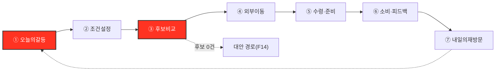
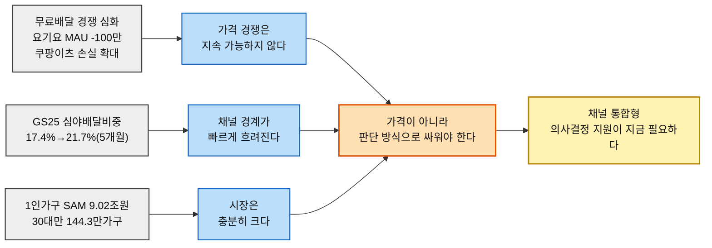
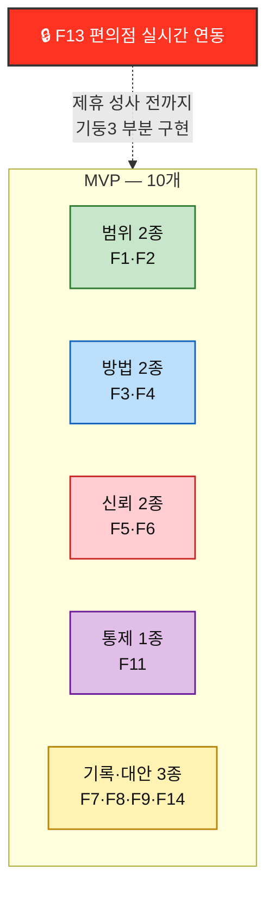

# Value Proposition Statement — 한끼라우터 v1.0

> **합본 안내.** 이 문서는 [01-Value-Proposition-통합문서.md](./01-Value-Proposition-통합문서.md)(01~08챕터 종합, Claude 작성)와 외부 산출물 `Value-Proposition-한끼라우터_GPT-5-Codex_High.md`(GPT-5 Codex High, 동일 원천자료 기반)를 대조해, 두 문서의 강점을 하나로 합친 v1.0이다. 어느 한쪽을 폐기하는 것이 아니라 **각 문서가 서로 놓친 부분을 상대가 메운 결과**다 — 무엇을 어디서 가져왔는지는 각 절 하단 `↳` 각주에 표시한다.

---

## 0. Executive Summary

**핵심 타깃**: 단순히 "30대 1인가구"가 아니라, **평일 퇴근 후 예산과 시간이 동시에 부족해 배달·포장·편의점-HMR 중 무엇을 고를지 반복해서 고민하는 사람**이다. 30대 1인가구는 이 상황을 검증하기 위한 PoC 모집 프록시다.

**핵심 문제**: 고객은 주문 자체를 못 해서가 아니라, 세 가지가 한꺼번에 해결되지 않아 피로를 겪는다 — ① 여러 채널을 오가며 가격·시간을 매번 다시 비교해야 함 ② 화면의 가격·시간·재고 정보가 실제와 맞는지 확신하기 어려움 ③ 한 번의 지출은 작아 보여도 누적 지출을 제때 인지·조절하기 어려움.

**Value Proposition**

> **오늘 가진 돈과 시간 안에서, 가장 납득되는 한 끼를 더 빨리 고르게 합니다.**

**이 문서에서 확정한 것**:
1. 원안(SRS)에서 SHOULD·후순위였던 "지출 요약"을 **경량 누적 지출 대시보드**로 범위를 좁혀 MVP에 승격한다 — AOS·DOS 최우선(P07·P09)과 JTBD 모의 인터뷰 양쪽에서 반복 확인됐다.
2. **C5(Q4 원형 핵심 페르소나)가 JTBD 인터뷰 대상에서 빠져 있다** — C1이 Q4 전체를 대표한다고 가정하면 안 되며, 실제 인터뷰 단계에서 반드시 보강해야 한다.
3. 경쟁 비교에서 한끼라우터가 **약한 축(매장 재고·개인 쿠폰 실시간성)도 하나 인정**한다 — 모든 축에서 이긴다고 말하지 않는다.

↳ 0은 GPT-5-Codex의 Executive Summary 구조를 채택하고, 항목 2·3은 두 문서 대조에서 새로 도출한 결정이다.

---

## 1. 문서를 읽기 전에 고정할 전제

### 1.1 근거 등급 — 5단계

| 등급 | 의미 | 이 문서에서의 예 |
| --- | --- | --- |
| **확인** | 공식 통계·기업 발표·실제 웹 검증으로 확인한 내용 | TAM 41.4882조원(2025), [08장](../../08.competitor-branding/1인가구한끼해결-경쟁사분석/01-경쟁사-가치선언-분석.md) 경쟁사 매출·MAU |
| **근사** | 확인된 자료를 다른 모집단에 적용해 계산한 추정치 | SAM 9.02조원(연령대 배달앱 결제액을 1인가구에 적용), SOM 약 3.1만 가구(전국 연령 비중을 관악구에 적용) |
| **추정** | 여러 확인 사실을 연결해 도출한 해석 | 경쟁사 가치 선언(활동에서 역산), 시장 공백 해석 |
| **가정** | 실제 인터뷰·행동 로그 없이 만든 제품 가설 | 12종 페르소나의 행동·감정, CJM 이탈 위험, JTBD 모의 응답, AOS·DOS 점수 |
| **내부 기준** | PoC 의사결정을 위해 설정한 성공 문턱 | 결정시간 30% 단축, 선택비용 10% 절감, 추천 수용률 40%, 오류율 5% 미만 |

↳ GPT-5-Codex의 5단계 체계를 채택 — 기존 우리 문서의 3단계(확인/추정/가정)보다 "근사"와 "내부기준"을 분리해 SAM·SOM 같은 값의 성격을 더 정확히 표시한다.

### 1.2 가장 중요한 한계

- JTBD 인터뷰 3건(C1·C3·A2)은 전부 **AI 모의 응답**이다. 인용문·Imp·Sat·AOS·DOS 재점수는 고객 증거가 아니라 인터뷰 설계 가설이다([07장](../../07.jtbd/1인가구한끼해결-jtbd/03-JTBD결과보고서.md)).
- 페르소나 12종과 CJM의 행동·감정·이탈 위험 전부 실제 인터뷰·퍼널 로그 없음.
- SAM 9.02조원은 연령대 전체 배달앱 평균 결제액을 같은 연령대 1인가구에 적용한 근사치, SOM 3.1만 가구는 전국 1인가구 연령 비중을 관악구에 적용한 모집단 추정치이며 매출 SOM이 아니다.
- 경쟁사 현황([08장](../../08.competitor-branding/1인가구한끼해결-경쟁사분석/01-경쟁사-가치선언-분석.md))은 2026년 8월 웹조사 기준이며 이 문서 작성 중 재조사하지 않았다.
- **⚠️ C5「둘 다 없다」(Q4 원형 핵심 페르소나)가 JTBD 인터뷰 대상에서 빠졌다.** [04-AOSxDOS-혼합매트릭스.md](../../06.market-opportunity/1인가구한끼해결-시장기회분석/04-AOSxDOS-혼합매트릭스.md)에서 C5는 "시장 주도" 사분면 상위이지만 모의 인터뷰 대상 3인(C1·C3·A2)에 포함되지 않았다 — **C1만으로 Q4(동시압박형) 전체를 대표시키지 말고, 실제 인터뷰 단계에서 C5 유형을 추가해 예산·시간 동시압박을 교차검증해야 한다.**

↳ 마지막 항목은 GPT-5-Codex 문서 §3의 지적을 그대로 채택한 것 — 우리 원 문서에는 이 위험이 명시돼 있지 않았다.

---

## 2. 서비스 정의

**오늘 한 끼의 예산·시간·취향을 입력하면 배달·포장·편의점-HMR 중 가장 적합한 경로를 정규화해 보여주는 의사결정 서비스**를 운영한다. 주문·결제·배차는 하지 않으며, 직접 판매하는 것은 음식이 아니라 **"오늘 가진 돈과 시간 안에서 가장 납득되는 선택"이라는 판단**이다.

| 제품 한 줄 | 위치·예산·최대시간·취향을 입력하면 배달·포장·편의점-HMR을 총비용·총시간으로 환산해 '절약·빠름·균형' 3개 선택지와 선택 근거, 누적 한 끼 지출까지 함께 보여주는 의사결정 서비스 |
| --- | --- |

---

## 3. 시장 범위와 세그먼트

### 3.1 TAM–SAM–핵심세그먼트–SOM

| 단계 | 시장 정의 | 규모 | 등급 |
| --- | --- | --- | :---: |
| **TAM** | 국내 온라인 음식서비스 전체 거래시장 | **41.4882조원**(2025) | 확인 |
| **SAM** | 1인가구가 배달·포장 채널에서 쓰는 연간 지출 | **약 9.02조원/년** | 근사 |
| **핵심 세그먼트 프록시** | 전국 30대 1인가구 | **144.3만 가구·약 1.76조원/년** | 근사 |
| **PoC 모집단 추정** | 관악구 30대 1인가구 | **약 3.1만 가구** | 근사(매출 SOM 아님) |

### 3.2 상황 기반 Market Segment

| | 예산 민감도 낮음 | 예산 민감도 높음 |
| --- | --- | --- |
| **시간 민감도 낮음** | Q1 여유형 — 1차 타깃 제외 | Q2 가성비 탐색형 — '절약' 모드 |
| **시간 민감도 높음** | Q3 시간 최우선형 — '빠름' 모드 | **Q4 동시압박형 — 핵심 타깃, '균형' 모드** |

이 세그먼트는 고정된 사람 유형이 아니라 **그날의 상황**이다. 같은 사용자가 월급일 직후엔 Q1, 월말 야근 중엔 Q4로 이동한다 — 제품은 가입 시 정한 성향보다 **매 끼니의 예산·시간 맥락**을 입력으로 우선한다.

### 3.3 산업분석과 최종 솔루션의 관계

[01~03장](../../01.porters-five-forces/분석④-1인가구배달플랫폼.md)의 Five Forces·가치사슬·KSF는 라이더와 주문 중개를 보유한 배달 플랫폼을 분석했다. 반면 한끼라우터는 주문·결제·배차를 하지 않는 의사결정 지원 서비스다 — **라이더 확보·단건배달·배차 효율은 직접 기능 요건이 아니다.** 이 분석의 핵심 결론은 **과밀한 실행 시장에 들어가지 말고, 기존 채널 위에서 의사결정 계층을 차지해야 한다**는 것이다.

↳ 3은 GPT-5-Codex §2 구조(TAM–SAM–Core Segment–SOM 4단 표, "산업분석과 최종솔루션의 관계")를 채택. 수치 자체는 두 문서가 동일 원천([04장](../../04.tam-sam-som/1인가구한끼해결-7단계/08-TAMSAMSOM단계별대응구조.md))에서 나와 일치한다.

---

## 4. 선별 페르소나와 선정 이유

| 우선도 | 페르소나 | 세그먼트 | 선정 이유 | VP에서의 역할 |
| --- | --- | --- | --- | --- |
| **Primary** | **C1**「퇴근을 예측할 수 없다」— 스타트업 백엔드 개발자 | Q4 Core | P01 반복결정 피로·P02 정보불신이 SAM·SOM 모두 최우선. 모의 JTBD에서 즉시결정·신뢰가 구체화됨 | "더 빨리"와 "납득되는 정보"의 핵심 고객 |
| **Primary-2** | **C3**「매일이 곧 지출이다」— 제조업 대기업 사무직 | Q2 Core | P07 지출방치·P09 누적확인불가가 SAM·SOM 모두 최우선. 경쟁사 조사에서도 누적 지출 도구 공백 확인 | "돈 안에서"와 "누적 통제"의 핵심 고객 |
| **Exploratory** | **A2**「또 그 메뉴다」— 프리랜서 디자이너 | Adjacent | 다양성 Pain은 있으나 SOM MR 0, 모의 JTBD에서 절박함이 하향됨([§11 반증](#11-proof) 참고) | 핵심 MVP 이후 개인화·탐색 기능 검증 대상 |

> 🚨 **C5「둘 다 없다」는 Q4의 전형적 페르소나지만 JTBD 모의 인터뷰 대상이 아니다.** 향후 실제 인터뷰에서는 C1만으로 Q4를 대표시키지 말고 C5 유형을 추가해 교차검증해야 한다.

> 📌 **12인 전체 페르소나의 Pain·CJM 병목은 §5-부록에 전체 랜드스케이프로 유지한다** — 3인으로 좁힌 것은 JTBD 심층 인터뷰 대상 선정이며, 시장 전체를 3인으로 축소한 것이 아니다.

↳ 이 절 전체가 GPT-5-Codex §3의 신규 채택분(원 문서엔 없었음). C5 경고가 이 절의 핵심 추가 가치다.

---

## 5. 페르소나 및 CJM 기반 고객별 핵심 문제

### 5.1 선별 3인 — Pain · Needs · 대안 · 설계 시사점

| 고객 | 핵심 상황 | 병목 단계 | Selected Pain | Needs | 현재 대안 | 설계 시사점 |
| --- | --- | --- | --- | --- | --- | --- |
| **C1** | 야근으로 퇴근 시각을 예측할 수 없고, 배고픈 상태에서 한 끼를 정해야 함 | ①오늘의갈등→②조건설정→③후보비교→⑤수령·준비 | **P01** 반복 결정 피로, **P02** 정보 갱신·정확성 불신 | 비교 단축, 최근 조건 자동 기억, 실제와 맞는 가격·시간, 추천 근거 확인 | 배민·쿠팡이츠·요기요를 번갈아 열어 직접 대조 | 입력 최소화·3카드만으로는 부족 — 출처·갱신시각·오류 이력까지 신뢰를 증명해야 함 |
| **C3** | 정시 퇴근하지만 요리 의욕이 없어 배달·포장이 반복되고, 카드값을 본 뒤에야 누적 지출을 인지 | ①오늘의갈등→③후보비교→⑥소비·피드백→⑦재방문 | **P07** 지출 방치·누적, **P09** 누적 지출 확인 불가 | 선택 전 현재 지출 수준 인지, 예산 안 자동 추천, 확인 자체가 숙제가 되지 않는 방식 | 평소 주문 반복 또는 며칠간 편의점 도시락으로 버틴 뒤 재복귀 | "싸게 고르기"보다 **누적을 자동으로 알아차리게 하기**가 중요 — 경량 지출 요약을 MVP로 승격할 근거 |
| **A2** | 배달앱 추천이 늘 비슷해 앱을 껐다가 비축한 밀키트를 반복 소비 | ①오늘의갈등→③후보비교→⑦재방문 | **P20** 다양성 결핍 | 미시도 옵션 발견, 익숙한 추천의 반복 감소 | 밀키트 대량구매·냉동보관 | 가격·시간 비교가 이 고객의 핵심 Job이 아님 — 별도 가치가 검증되기 전까지 MVP 범위를 넓히지 않음 |

### 5.2 CJM 공통 구조 — 병목은 ③후보비교와 ①오늘의갈등에 집중

핵심 병목은 결제가 일어나는 ④가 아니라 **③후보비교**와 **①앱을 열지 결정하는 순간**이다 — 앱 내 결제 구현보다 정확한 후보 데이터·신뢰 표시·반복 입력 축소에 우선 투자한다.

### 5.3 12인 전체 페르소나 랜드스케이프 (부록)

| 인물 | 스펙트럼 | 핵심 Pain | 병목 단계 |
| --- | :---: | --- | :---: |
| C1「퇴근을 예측할 수 없다」 | 🔵 핵심 | P01·P02 | ②~③ |
| C2「마감엔 다 필요없다」 | 🔵 핵심 | P04 마감과 식사 결정이 겹침 | ① |
| C3「매일이 곧 지출이다」 | 🔵 핵심 | P07·P09 | ①·⑥ |
| C4「기운이 없는데 골라야 한다」 | 🔵 핵심 | P10 지친 결정 부담 | ② |
| **C5「둘 다 없다」** | 🔵 핵심 | **P13 예산·시간 동시압박** — Q4 원형, 인터뷰 미포함(§4 경고) | ②~③ |
| A1「1인분은 손해다」 | 🟢 확장 | P16·P17 최소주문금액·1인분 필터 부재 | ③ |
| A2「또 그 메뉴다」 | 🟢 확장 | P20 다양성 결핍 | ③ |
| A3「같이 살아도 혼자 먹는다」 | 🟢 확장 | P22·P23 1인가구 전제 안 맞음 | ② |
| X1「새벽엔 문 닫은 도시」 | 🔴 극단 | P25·P26·P27 영업시간 벽·후보 0건 | ②~③(존재론적 관문) |
| X2「지도 밖의 동네」 | 🔴 극단 | P28·P29·P30 선택지 없어 비교 무의미 | ②~③ |
| N1「안 시켜도 괜찮다」 | ⬜ 비활성 | P31 트리거 부재 | ① 이전 |
| N2「전화가 더 빠르다」 | ⬜ 비활성 | P32 앱 형식 자체가 장벽 | ① 이전 |

> 📌 **32개 Pain을 관통하는 Need**: 불편이 아니라 "선택의 반복"(P01·P04·P10·P13), AOS 최상위는 "대체재가 아예 없는" 자리(X1·X2 야간 커버리지), Non-user는 트리거 자체가 발생하지 않음.

↳ 5.1은 GPT-5-Codex §4의 6열 표(현재대안·설계시사점 포함) 구조를 채택, 5.2·5.3은 우리 원 문서의 강점(12인 전체 랜드스케이프, 관통 Need 통찰)을 유지.

---

## 6. JTBD 관점 — 고객 상황별 Goal · Job

> [07장 JTBD 요약 카드](../../07.jtbd/1인가구한끼해결-jtbd/03-JTBD결과보고서.md)에서 추출. 실제 인터뷰가 아닌 모의 응답 기반 가설이다.

| Job ID | 인물 | Situation (When…) | Job Statement (…I want to…) |
| :---: | --- | --- | --- |
| **J1** | C1 | 야근으로 퇴근 시각이 언제인지도 모를 때 | 세 개 앱을 다시 비교하지 않고 한 끼를 **즉시 확정**한다 |
| **J2** | C3 | 퇴근 후 요리할 힘이 없고 평소처럼 바로 주문하려는 순간 | 생각 없이 주문하더라도 이번 달 지출이 **늘지 않게 관리**한다 |
| **J3** | A2 | 배달앱을 켜도 추천이 뻔하게 느껴질 때 | 새로 고민하는 수고 없이 **미시도 선택지를 발견**한다 |
| **J4** | 공통(X1·X2 특히) | 조건에 맞는 후보가 없을 때 | 그래도 **다음 행동을 찾는다**(0건 대안) |
| **J5** | 공통(C1·C5 특히) | 반복 사용할수록 | 입력과 검증 **수고를 줄인다** |

> 🎯 **J1·J2의 동사(확정하다·억제하다)와 J3의 동사(발견하다)가 정반대 방향이다.** J1·J2는 **애쓰지 않아도 되는 상태**를 원하고, J3는 **적극적으로 더 애써주길** 원한다 — 정보를 줄이면 J1·J2엔 좋고 J3엔 나쁘다는 설계상 긴장 관계다. J3(A2)는 [§11 반증](#11-proof)에서 다시 확인하듯 실제로 가장 약하게 확인됐다 — **J3를 J1·J2와 같은 비중으로 두면 안 된다.**

### 6.1 페르소나별 JTBD 선언

**C1** — *"야근으로 퇴근 시각을 예측하기 어려울 때, 세 개 앱을 다시 비교하지 않고도 믿을 수 있는 한 끼를 바로 확정해 쉬는 시간을 확보하고 싶다."*
**C3** — *"퇴근 후 요리할 힘이 없을 때, 별도의 가계부를 챙기지 않고도 누적 지출을 알아차리고 예산 안에서 한 끼를 정해 카드값 후회를 줄이고 싶다."*
**A2** — *"추천이 늘 비슷하게 느껴질 때, 새로 탐색하는 수고 없이 전에 먹지 않은 선택지를 발견해 반복 피로를 줄이고 싶다."*

↳ J1~J3은 우리 원 문서, **J4·J5(공통 Job)는 GPT-5-Codex 채택분** — F9(관리자데이터관리 제외)·F10(최근조건기억)·F14(0건대안)처럼 특정 페르소나에 안 묶이는 기능의 근거가 됐다. "동사 방향 불일치" 통찰은 우리 원 문서의 강점으로 유지.

---

## 7. 고객이 원하는 Outcome

> 측정 가능한 형태로 서술. `📏`는 모의 인터뷰에서 구체적 수치가 확보된 항목. DOS(SAM) 내림차순.

| # | Outcome | 인물 | Imp | Sat | AOS | DOS(SAM) | DOS(SOM) | 상태 | 측정 표현 |
| :---: | --- | :---: | :---: | :---: | :---: | :---: | :---: | --- | --- |
| **O01** | 반복 결정 없이 즉시 확정 | C1 | 5 | 2 | 3.0 | **0.60** | 2.70 | SRS 내부 기준. 실제 베이스라인 필요 | 📏 비교에 15분 소요 → 목표 즉시 |
| **O02** | 누적 지출을 확인해 통제(대시보드) | C3 | 4 | 1 | 3.2 | **0.60** | 1.80 | 비용 목표는 SRS 기준, 인지효과 목표치는 PoC 후 설정 | 예산 초과 0건(목표치 미확정) |
| **O03** | 과거 추천 정확도 이력을 근거로 신뢰 | C1 | 3 | 1 | 2.4 | **0.40** | 1.80 | 신규 검증 항목 | 이력 확인 횟수(미확정) |
| **O04** | 화면 정보를 재확인 없이 신뢰 | C1 | 4 | 2 | 2.4 | **0.40** | 1.80 | SRS 내부 기준(오류율 5% 미만) | 원 서비스 재확인율(미확정) |
| **O05** | 지출이 쌓이는 것을 미리 인지·조절 | C3 | 4 | 2 | 2.4 | **0.40** | 1.20 | 신규 검증 항목 | 미확정 |
| **O06** | 예산 확인이 자동으로, 새 숙제 없이 | C3 | 3 | 1 | 2.4 | **0.40** | 1.20 | 신규 검증 항목 | 미확정 |
| **O07** | 조건 재입력 없이 최근 조건 기억 | C1 | 3 | 2 | 1.8 | **0.20** | 0.90 | 신규 검증 항목 | 미확정 |
| **O08** | 매번 다른 선택지를 추천 | A2 | 3 | 2 | 1.8 | **0.13** | 0.00 | **MVP 후순위** — §11 반증으로 하향 재판정됨 | 미시도 옵션 비율(미확정) |
| **공통** | 상위 3개 카드 중 하나를 최종 선택 | C1·C3 | — | — | — | — | — | SRS 내부 기준 | 📏 추천 수용률 **40% 이상** |
| **공통** | 처음 생각한 채널과 다른 채널 선택 | C1·C3 | — | — | — | — | — | 탐색 지표, 목표치 없음 | 관찰만 |

> ⚠️ **측정 표현이 붙은 것은 10개 중 2개뿐(O01, 공통 수용률)이다.** 나머지는 실제 인터뷰에서 반드시 받아 와야 할 목록이다.

↳ Outcome ID·DOS(SAM/SOM) 이중 표기는 우리 원 문서 유지, **"상태" 컬럼은 GPT-5-Codex 채택**(신규검증항목/SRS내부기준 등 구분이 실행 관점에서 더 명확함).

---

## 8. 기존 대안 (Competitor / Substitute)

### 8-1. 경쟁 기업 — 실사 (확인)

| 서비스 | 경쟁 축 | 규모 | 가치 선언(역산) |
| --- | :---: | --- | --- |
| **배달의민족** | ①배달채널 | MAU 2,375만(1위), 매출 5조2,829억원(+22%) | "1인분이라도, 전국 어디서든, 소외되지 않는 한 끼를" |
| **쿠팡이츠** | ①배달채널 | MAU 1,316만(+26%), 연간손실 9.95억달러로 확대 | "얼마를 시키든, 배달비 걱정 없이" |
| **요기요** | ①배달채널 | MAU 418만(1년새 -100만), 업계 3위 | "가장 싼 곳이 아니라, 가장 즐거운 한 끼를" |
| **두잇** | ①배달채널(니치) | 서울 5개구 한정, 가입자 120만 | "혼자여도, 먹고 싶은 만큼만, 가장 저렴하게" |
| **배달핏** | ②배달앱 간 비교 | 회사 실체 확인 불가, 웹사이트 기반 | "어떤 배달앱 편도 들지 않고, 가장 싼 선택지를" |
| **GS25** | ③분리된 채널 | 편의점 매출 약 8조9,396억원, 심야배달비중 21.7%(2026.4) | "24시간보다 더 큰 가치로, 우리 동네의 모든 순간을" |

### 8-2. 행동적 대안 — Job 프레이밍(추정)

| 대안 | 고객이 현재 고용하는 이유 | 해결하는 Job | 남는 공백 |
| --- | --- | --- | --- |
| 배달앱 3개 직접 비교 | 본인이 직접 확인해야 가장 정확하다고 느낌 | 최저가·최단시간 검증 | 앱 전환·반복 비교에 시간과 피로가 큼 |
| 늘 먹던 메뉴 재주문 | 생각할 필요가 없음 | 결정 부담 최소화 | 예산 초과·누적 지출·선택 반복을 방치 |
| 밀키트 비축·편의점 도시락 | 가격·준비시간이 예측 가능 | 배달 대체, 실패 위험 축소 | 다양성·재고·가열 가능 여부 제약, 채널 비교는 여전히 직접 해야 함 |
| 가계부·카드앱 사후 확인 | 월 지출을 확인할 수 있음 | 지출 기록·회고 | 한 끼를 고르는 순간의 추천과 분리 — 사전 의사결정에 반영되지 않음 |

> 🚨 **우리는 세 개 축에서 동시에 신생이다** — §8-1의 여섯 회사 각각 이미 한두 축에서 강하다.
> ⚠️ **'무료배달'은 이미 레드오션이다** — 배민·쿠팡이츠·두잇 셋 다 가격을 브랜드 축으로 잡았다.

↳ 8-1(실사, 검증 링크 포함)은 **우리 원 문서의 강점**([08장](../../08.competitor-branding/1인가구한끼해결-경쟁사분석/01-경쟁사-가치선언-분석.md) 원본 그대로), 8-2(행동적 대안·Job 프레이밍)는 **GPT-5-Codex 채택분** — JTBD 방법론의 "현재 고용 중인 대안" 정의를 회사 단위를 넘어 행동 단위까지 넓혔다.

---

## 9. 우리 솔루션의 핵심 제안 (Value Proposition)

> ## **"오늘 가진 돈과 시간 안에서, 가장 납득되는 한 끼를 더 빨리 고르게 합니다."**

### 9.1 이 문장이 성립하는 이유 — 절별 필요조건

| 절 | 대응 기둥 | 경쟁 공백 |
| --- | --- | --- |
| *"오늘 가진 돈과 시간 안에서"* | **범위 — 채널을 넘나드는 단일 기준** | 배달 4사는 배달채널 내부, 배달핏은 배달앱 간 조건만. 세 채널을 하나의 기준으로 비교하는 곳은 없음 |
| *"가장 납득되는… 더 빨리"* | **방법 — 가격·시간 동시 최적화** | 6개사 전부 단일 축(가격/즐거움/편의성)에 머문다 |
| — *(마스터 선언 밖, §10-4 확장 기둥)* | **통제 — 누적 지출 인지** | 개인 누적 한 끼 지출을 보여주는 곳이 없음(§8-1·8-2 공통 공백) |
| *(전제)* | **신뢰 — 이해관계 없는 판단** | 배달 4사는 자기 채널 매출에 이해관계가 있고, 배달핏의 중립성은 배달앱 3사에 갇힘 |

> 📌 **셋(범위·방법·신뢰)은 마스터 선언 문장 자체의 필요조건**이다 — 하나를 빼면 그 절이 거짓이 된다([08장 §2 제거 논증](../../08.competitor-branding/1인가구한끼해결-경쟁사분석/02-차별적가치목표-제안.md)). **통제(누적 지출)는 마스터 문장에 아직 명문화되지 않은 확장 가치**다 — JTBD가 발견했지만 원 문장은 단발 선택 시점만 다루기 때문이다. 이 구분을 숨기지 않는다(§10-4).

### 9.2 제품 경계

| 한끼라우터가 하는 것 | MVP에서 하지 않는 것 |
| --- | --- |
| 채널 간 총비용·총시간 정규화 | 직접 주문·결제 |
| 예산·시간을 넘는 옵션 사전 제거 | 라이더 배차·배송 운영 |
| 절약·빠름·균형 3개 카드와 추천 이유 제공 | 음식점 정산·구독권 판매 |
| 데이터 출처·갱신시각·불확실성 표시 | 개인별 쿠폰·멤버십 실시간 자동 계산 |
| 경량 누적 지출·예산 상태 표시 | 종합 가계부·재무관리 |
| 기존 서비스·매장으로 이동 | 특정 채널의 주문 전환을 우선하는 광고형 랭킹 |

↳ 9.1의 절별 필요조건 표는 우리 원 문서 강점(마스터 문장의 논리적 필수성 논증), 9.2 제품 경계 2열 표는 **GPT-5-Codex 채택분** — 하는 것/안 하는 것이 한 표에 나란히 있어 더 스캔하기 쉽다.

---

## 10. 우리가 제공하는 차별적 가치

### 10.1 핵심 3기둥 (마스터 선언의 필요조건)

| 기둥 | 선언(공개 약속형) | 청중 | 지금 실행 가능? |
| --- | --- | --- | :---: |
| **1. 신뢰** | "추천 순서와 필터링 로직에 채널·업체별 차등을 두지 않습니다." | 반복 이용자(C1형) | ⏳ 설계 원칙은 지금, **대외 선언은 수익모델 확정 후** |
| **2. 방법** | "가격 40%, 시간 30%식 가중치 없이, 두 조건을 동시에 만족하는 선택만 남깁니다." | 전체 사용자, 특히 C1·C3 | ✅ 오늘 가능(SRS Pareto로 이미 완성) |
| **3. 범위** | "배달·포장·편의점을 같은 총비용·총시간 기준으로 비교합니다." | 전체 사용자 + 편의점 대체 이용군 | ✅ 선언은 오늘 가능, **구현은 부분적**(편의점 데이터 제휴 전) |

### 10.2 세 기둥은 같은 약점을 뒤집은 것이다

| 기둥 | 우리 약점 | 뒤집힌 결과 |
| --- | --- | --- |
| 1(신뢰) | 수익모델이 아직 없다 | **그래서 지금은 완전히 중립적이다** |
| 2(방법) | 없음 — 이미 완성 | 약점 없이 바로 강점 |
| 3(범위) | 편의점 실시간 데이터를 소유하지 않는다 | **그래서 어느 채널에도 종속되지 않은 재가공자로 포지셔닝** |

### 10.3 확장 기둥 4 — 통제(누적 지출 연결)

- 추천 시점에 이번 주·이번 달 한 끼 지출을 간단히 보여준다.
- 별도 가계부를 열지 않아도 현재 예산 상태를 알아차리게 한다.
- 종합 금융관리로 확장하지 않고, **한 끼 의사결정에 필요한 최소 범위만** 다룬다.

> 📌 **왜 4번째 기둥으로 별도 승격했는가**: O02·O05·O06(§7)이 DOS(SAM) 상위 3위 안에 들 정도로 근거가 강하지만, 마스터 문장의 필요조건(9.1)에는 들어가지 않는다 — 단발 선택이 아니라 **반복 사용에 걸친 관계**를 다루기 때문이다. 필요조건과 확장가치를 섞으면 9.1의 논리적 엄밀성이 흐려지므로 분리한다.

↳ 10.1·10.2는 우리 원 문서, **10.3(4번째 기둥)은 GPT-5-Codex의 구조를 채택하되, 마스터 문장 필요조건과는 명시적으로 분리**해 두 문서 접근의 논리적 긴장을 정직하게 남겼다.

---

## 11. Proof

### 11.1 고객가치 도출의 근거 — 여섯 경로가 같은 곳을 가리켰다

| 경로 | 산출물 | 지목한 것 | 근거강도 |
| --- | --- | --- | :---: |
| ① 페르소나 스펙트럼 | C1·C3가 Core에서 반복결정·지출 문제로 정의됨 | 즉시확정·지출가시화 | 가정 |
| ② 고객여정지도 | 병목이 ②~③(C1), ①~⑥(C3)에 집중 | 반복적 판단 부담 | 가정 |
| ③ AOS | P01(3.0) 2위권, P07·P09·P20(각 2.4) 6위권 동률 | 즉시확정 최우선 | 가정 위 파생점수 |
| ④ DOS(SOM) | O01(2.70)·O02(1.80) 1년차 검증 순서 1·2위 | 즉시확정+지출가시화 | 가정 위 파생점수 |
| ⑤ JTBD 모의인터뷰 | C1·C3 재확인+구체화(O03·O07 신규), A2는 오히려 약화 | 같은 결론 재확인 | 모의 인터뷰 가정 |
| ⑥ 경쟁사 조사 | 6개사 누구도 채널통합+가격시간 동시최적화 선언 안 함 | 공백 실증 | 경쟁 활동 확인/공백 해석 |

> 🎯 모수 선택도, 분석 방법(정량 채점/모의 인터뷰/경쟁 실사)도 이 결론을 바꾸지 못했다.

### 11.2 시급성 근거 — 시장·경쟁 통계(확인)

### 11.3 경쟁 대안과의 가치 비교 — 4단계 척도

범례: `●` 핵심 제공 · `◐` 부분 제공 · `○` 제공하지 않음 · `△` 한끼라우터도 데이터 제약으로 부분 제공(약점 인정)

| 가치 기준 | 배달3사 | 두잇 | 배달핏 | GS25/HMR | 직접 앱 비교 | **한끼라우터** |
| --- | :---: | :---: | :---: | :---: | :---: | :---: |
| 실제 주문·결제·배송 | ● | ● | ○ | ◐ | ● | ○ |
| 배달·포장·HMR 채널 간 비교 | ○ | ○ | ○ | ○ | ○ | **●** |
| 총비용·총시간 동시 비교 | ◐ | ◐ | ◐ | ○ | ◐ | **●** |
| 개인 누적 한 끼 지출 인지 | ○ | ○ | ○ | ○ | ○ | **●** |
| **매장 재고·개인 쿠폰 실시간성** | ◐ | ◐ | ◐ | ● | ● | **△(약점 인정)** |
| "세지 않겠다"(이해관계 무선언) | ✖ | ✖ | ⚠️부분 | ✖ | — | **✔(예정)** |

> 📌 한끼라우터의 차별성은 주문 실행이 아니라 **서로 다른 채널을 같은 기준으로 판단하게 하고, 그 판단을 누적 지출과 연결하는 것**이다. 반대로 **실시간 개인 쿠폰·재고 정확도는 기존 원 서비스보다 약할 수 있으므로** 갱신시각·불확실성 표시가 필수다 — 이 표는 우리가 이기는 축만 고르지 않는다.

### 11.4 반증된 것도 함께 기록한다

| 항목 | 한때의 판정 | 반증 | 출처 |
| --- | --- | --- | --- |
| **P26 커버리지 신뢰 부재**(X1) | AOS 3.2, 공동 1위 | GS25의 24시간 운영+심야배달 확대(21.7%)가 부분 대안 제공 → AOS **2.4**로 재판정 | [08장 §4-3](../../08.competitor-branding/1인가구한끼해결-경쟁사분석/01-경쟁사-가치선언-분석.md) |
| **O08 다양성 결핍**(A2) | AOS 2.4 | 모의 인터뷰 어조가 "지루함·체념"에 가까움 → AOS **1.8**로 하향, MVP 후순위로 재조정 | [07장 §3-1](../../07.jtbd/1인가구한끼해결-jtbd/03-JTBD결과보고서.md) |

> 🎯 반증을 남기는 것이 이 문서의 신뢰 근거다 — 한때 상위권이던 두 항목을 스스로 낮춘 기록이 있어야 남은 C1·C3 기회가 살아남은 것이라는 말에 무게가 실린다.

↳ 11.1·11.2·11.4는 우리 원 문서 강점(6경로 수렴, 시급성 인과 다이어그램, 반증 로그). **11.3의 4단계 척도와 "약점 인정" 행은 GPT-5-Codex 채택분** — 원래 우리 3단계 표는 이기는 축만 골라 편향돼 있었다.

---

## 12. Job–Feature Map

### 12.1 기능 명세

> `🔒`는 외부 데이터 제휴에 종속된 기능. 중요도 = AOS·DOS 순위+여정 병목 여부, 난이도 = 개발·데이터 확보 난도.

| 기능명 | Job 연관 | 중요도 | 난이도 | MVP | 우선순위 | 판단 근거 |
| --- | :---: | :---: | :---: | :---: | :---: | --- |
| **F1** 위치/예산/시간/취향 입력 | J1·J2 | 5 | 2 | ✔ | High | SRS FR-01·02, 모든 Job의 입력 전제 |
| **F2** 배달·포장·편의점-HMR 정규화 | J1·J2·J3 | 5 | 4 | ✔ | High | SRS FR-03, 기둥3(범위)의 기술적 실체 |
| **F3** 조건 필터(예산/시간/영업/최소주문) | J1·J2·J4 | 4 | 2 | ✔ | High | SRS FR-04 |
| **F4** 추천 생성 — 절약/빠름/균형 3카드(Pareto) | J1·J2 | 5 | 3 | ✔ | High | SRS FR-05, 기둥2(방법) 핵심 |
| **F5** 비교 상세 — 가격·시간 구성, 갱신시각 | J1(정보신뢰) | 4 | 2 | ✔ | High | SRS FR-06, O04 |
| **F6** 추천 로직 노출순서 무차등(로그화) | 기둥1(신뢰) | 5 | 2 | ✔ | High | 기둥1의 최소요건 |
| **F11** 누적 지출 대시보드 *(JTBD 신규, 경량화)* | J2(C3) | **5** | 3 | ✔ **(격상)** | **High** | O02·O05·O06 최우선 실험, SRS 원안 SHOULD→격상 |
| **F14** 결과 0건 대안 경로 *(신규 채택)* | J4 | 4 | 2 | ✔ **(신규)** | Mid | X1·X2 Pain(P27·P30), 실패 UX 방지 |
| **F7** 외부 이동(원 서비스 딥링크) | J1, 기둥1 | 3 | 1 | ✔ | Mid | SRS FR-07 |
| **F8** 선택 결과·피드백 기록 | J1·J5 | 3 | 2 | ✔ | Mid | SRS FR-08, F12의 원재료 |
| **F9** 관리자 데이터 관리 | 데이터 신뢰성 | 3 | 3 | ✔ | Mid | SRS FR-09 |
| **F10** 최근 조건·선택·즐겨찾기 | J5(C1) | 3 | 2 | △(SHOULD) | Mid | O07, SRS FR-10 |
| **F12** 추천 정확도 이력 노출 *(JTBD 신규)* | J1(C1), 기둥1 | 4 | 4 | ✖ | Mid | O03, 이력 축적 인프라 필요 |
| **F13** 🔒 편의점 재고 실시간 연동 | 기둥3(범위) 완성 | 4 | 5 | ✖ | Mid | 데이터 제휴 의존, §10.1 리스크 |

**MVP 10개(F1~F11, F14) · Phase 2 3개(F10·F12·F13)**

### 12.2 MVP 판단 원칙

1. **High**: 핵심 Job을 수행하지 못하면 제품 가치가 성립하지 않는 기능.
2. **Mid**: 핵심 가치의 신뢰·반복사용·실패복구를 높이지만 제한된 형태로 시작 가능한 기능.
3. **Phase 2**: 인접 Job이거나 외부 데이터·운영 부담이 커 핵심 가치 검증을 흐리는 기능.

### 12.3 MVP 그룹과 구현 순서

| 단계 | 포함 기능 | 진입 조건 |
| --- | --- | --- |
| **PoC** | F1~F5, 경량 F11, F14 | 핵심 흐름 사용성 확인 |
| **MVP** | F6~F9(완성), F10 | PoC에서 결정시간·비용 개선과 오류율 기준 충족 |
| **Phase 2** | F12, F13, 다양성(F-A2) | 실제 JTBD 검증 + 데이터 제휴 확보 |
| **제외 유지** | 주문·결제·배차·정산 | 별도 사업모델·규제 검토 전에는 확장하지 않음 |

↳ F1~F13은 우리 원 문서, **F14(0건 대안)는 GPT-5-Codex 채택 신규 기능**(우리 06장 Pain P27·P30에 이미 근거가 있었지만 Feature로 전환되지 않았던 것). "판단근거" 컬럼과 PoC/MVP/Phase2/제외유지 4단계 구조도 GPT-5-Codex 채택.

---

## 13. 검증 설계와 반증 조건

### PoC 핵심 지표

| 지표 | 성공 기준 | VP와의 연결 |
| --- | ---: | --- |
| 결정시간 중앙값 | 기존 대비 **30% 이상 단축** | "더 빨리" |
| 선택 총비용 중앙값 | 기존 첫 선택 대비 **10% 이상 절감** | "가진 돈 안에서" |
| 추천 수용률 | 상위 3개 중 선택 **40% 이상** | "납득되는 선택" |
| 데이터 오류율 | **5% 미만** | 기둥1(신뢰) |
| 예산 인지 변화 | 누적 지출 노출 전후 예산 내 선택률·자기보고 인지 변화 | 기둥4(통제) |
| 채널 전환률 | 목표치 없이 관찰 | 기둥3(범위)이 실제 선택을 바꾸는지 확인 |

### 반증 조건 — 다음 중 하나가 반복되면 이 VP를 수정한다

- 결정시간은 줄지만 추천 수용률이 낮다 → 정보 요약은 유용해도 추천 방식이 납득되지 않는 것.
- 비용은 줄지만 만족도가 크게 낮아진다 → 가격·시간 최적화가 취향을 훼손한 것.
- 오류율이 5%를 넘거나 외부 이동 후 가격 차이가 반복된다 → **기둥1(신뢰)이 성립하지 않는 것.**
- 누적 지출 표시(F11)가 선택 행동을 바꾸지 않는다 → 지출 가시화는 Pain이지만 이 서비스가 풀 Job은 아닐 수 있음.
- 사용자가 배달·포장·HMR을 비교하지 않고 원래 채널만 고수한다 → **기둥3(범위)이 실제 전환가치를 만들지 못한 것.**
- A2 유형이 새 옵션보다 익숙한 밀키트를 계속 선택한다 → 다양성 기능(F-A2)을 로드맵에서 제외하는 §11.4의 판단을 유지.
- **C5 유형 인터뷰에서 C1과 확연히 다른 반응이 나온다** → §4의 대표성 경고가 실현된 것, Q4 세그먼트 전체 전략을 재검토.

↳ **13 전체가 GPT-5-Codex §13의 채택분** — 우리 원 문서에는 사전 반증조건 섹션이 없었다. 항목 중 "C5 인터뷰" 조건은 이번 합본에서 새로 추가한 것(§4 경고와 직결).

---

## 14. 핵심 리스크와 대응

| 리스크 | 구조적 영향 | 대응 |
| --- | --- | --- |
| **실제 인터뷰 부재** | Pain·Outcome 우선순위가 뒤집힐 수 있음 | C1·C3·**C5** 실제 인터뷰를 먼저 실시하고 수치·허용오차 확보 |
| **실시간 가격·쿠폰 접근 제한** | 외부 이동 후 가격 차이로 신뢰 훼손 | 확인 가능한 할인만 반영, 회원혜택 분리, 갱신시각·추정 배지 표시 |
| **편의점 재고 불확실성** | 채널 통합 가치(기둥3)가 형식적으로만 남을 수 있음 | 재고 확인 가능 품목 우선, 미확인 배지, 체인 제휴 가능성 확인(F13) |
| **SAM·SOM 모집단 가정** | 시장 규모가 실제보다 과대·과소 추정될 수 있음 | 1인가구 카드 소비 데이터와 관악구 연령별 통계로 보정 |
| **중립성과 수익모델 충돌** | 기둥1(신뢰)의 브랜드 약속이 무너질 수 있음 | 제휴·광고가 순위에 영향을 주는지 공개, 무차등 원칙을 정책으로 명문화(F6) |
| **범위 팽창** | 주문·배차·정산으로 넘어가면 Five Forces의 과밀 경쟁을 직접 떠안음 | 의사결정 지원·외부 이동 경계 유지(§9.2) |
| **F11 기능의 제품 정체성 팽창** | 지출 기능이 종합 가계부로 변질될 수 있음 | "한 끼 지출"과 추천 시점의 예산 인지에만 범위 제한 |

↳ GPT-5-Codex §14 채택 — 우리 원 문서엔 리스크가 각 섹션에 ⚠️/🚨로 흩어져 있었고 통합 표가 없었다.

---

## 15. 최종 Value Proposition Statement

### 내부 전략문

> **평일 퇴근 후 혼자 한 끼를 해결해야 하지만 돈과 시간이 모두 빠듯한 사람을 위해, 한끼라우터는 배달·포장·편의점-HMR을 총비용과 총시간으로 정규화하고 절약·빠름·균형 3개 선택지와 근거, 누적 지출을 함께 보여준다. 여러 앱을 직접 비교하거나 생각 없이 재주문하는 대안과 달리, 사용자가 주문 전 한 화면에서 더 빠르고 납득 가능하게 결정하도록 돕는다.**

### 대외 마스터 문장

> **오늘 가진 돈과 시간 안에서, 가장 납득되는 한 끼를 더 빨리 고르게 합니다.**

### 태그라인

| 후보 | 문장 | 강조점 | 지금 사용 가능? |
| :---: | --- | --- | :---: |
| 1 | 가장 싼 게 아니라, 가장 납득되는 한 끼. | 기둥2 | ✅ |
| 2 | 배달이든 포장이든 편의점이든, 기준은 하나. | 기둥3 | ✅(구현은 부분적) |
| 3 | 돈도 시간도, 그리고 지출도 — 한 화면에서. | 기둥4 | ✅(경량형 기준) |
| 4 | 누구의 편도 아닌 추천. | 기둥1 | ⏳ 수익모델 확정 후 |

↳ 내부전략문/대외문장 분리는 GPT-5-Codex 채택, 태그라인 표는 두 문서의 후보를 합쳐 4개로 확장(기둥4용 태그라인 신설).

---

## 16. 출처 추적표

| 입력 문서 | 이 문서에 반영한 내용 |
| --- | --- |
| [01.porters-five-forces](../../01.porters-five-forces/분석④-1인가구배달플랫폼.md) | Five Forces, 과밀 경쟁, 대체재 위협, 니치 진입 시사점(§3.3) |
| [02.value-chain](../../02.value-chain/분석-1인가구배달플랫폼.md) | 라이더·배송 중심 가치사슬, 실행 플랫폼 범위의 비용 구조(§3.3) |
| [03.ksf](../../03.ksf/신규진입자-Top5-KSF-1인가구배달플랫폼-기업사례포함.md) | 니치·수요예측·소액주문·배달운영 KSF와 최종 서비스 경계 판단(§3.3) |
| [04장 07-SRS](../../04.tam-sam-som/1인가구한끼해결-7단계/07-솔루션구체화-SRS.md) | 제품 정의, Pareto 추천, PoC 지표, FR/NFR, 데이터·MVP 범위(§2·§9·§12·§13) |
| [04장 08-TAMSAMSOM](../../04.tam-sam-som/1인가구한끼해결-7단계/08-TAMSAMSOM단계별대응구조.md) | TAM 41.4882조원, SAM 9.02조원, PoC 모집단 약 3.1만 가구(§3.1) |
| [04장 09-마켓세그먼트맵](../../04.tam-sam-som/1인가구한끼해결-7단계/09-마켓세그먼트맵.md) | 예산×시간 2×2, Q4 핵심 상황, 30대 프록시(§3.2) |
| [05장 02-페르소나스펙트럼](../../05.persona-journey-map/1인가구한끼해결-페르소나여정/02-페르소나스펙트럼.md) | 12종 페르소나 중 C1·C3·A2(및 C5 경고)의 문제·목표·대안(§4·§5.3) |
| [05장 06-고객여정지도-종합판](../../05.persona-journey-map/1인가구한끼해결-페르소나여정/06-고객여정지도-종합판.md) | 7단계 CJM, ①·③ 병목, 개선 기회(§5.2) |
| [06장 04-AOSxDOS-혼합매트릭스](../../06.market-opportunity/1인가구한끼해결-시장기회분석/04-AOSxDOS-혼합매트릭스.md) | P01·P02·P07·P09 최우선, P20·Extreme Pain의 후순위/니치 판단, C5 시장주도 사분면(§4·§7) |
| [07장 02-모의인터뷰응답](../../07.jtbd/1인가구한끼해결-jtbd/02-모의인터뷰응답.md) | C1·C3·A2의 모의 발화, Job·불안·습관·전환장벽(§6) |
| [07장 03-JTBD결과보고서](../../07.jtbd/1인가구한끼해결-jtbd/03-JTBD결과보고서.md) | JTBD 카드, O01~O08, 반증 기록(§6·§7·§11.4) |
| [08장 01-경쟁사-가치선언-분석](../../08.competitor-branding/1인가구한끼해결-경쟁사분석/01-경쟁사-가치선언-분석.md) | 경쟁 축, 기존 대안, 시장 공백, P26 재판정(§8·§11.4) |
| [08장 02-차별적가치목표-제안](../../08.competitor-branding/1인가구한끼해결-경쟁사분석/02-차별적가치목표-제안.md) | 마스터 선언, 신뢰·방법·범위 3기둥, 선언 활성화 조건(§9·§10) |
| `Value-Proposition-한끼라우터_GPT-5-Codex_High.md` | Executive Summary·5단계 근거등급·C5 경고·검증설계·리스크레지스터·출처추적표 구조, F14 신규 기능(전 절 표시된 ↳) |

---

## 17. 근거 등급 총괄

| 구성 요소 | 등급 |
| --- | :---: |
| §3.1 TAM/§8-1 경쟁사 규모 | 확인 |
| §3.1 SAM·SOM | 근사 |
| §8-1 가치 선언, §11.1 여섯 경로 수렴 해석 | 추정 |
| §5·§6·§7 Pain·Job·Outcome·AOS·DOS 수치 | 가정 |
| §13 PoC 성공 기준 | 내부 기준 |
| §12 Job-Feature Map 우선순위 | 위 값들의 추정 종합 |

> ⛔ §5~§7·§12의 수치는 실제 인터뷰(특히 **C5 포함**)가 끝나면 재작성 대상이다.

## 18. 다음 단계

| 순위 | 할 일 | 넘기는 것 |
| :---: | --- | --- |
| **1** | **C1·C3·C5 실제 인터뷰 실행** | §4 경고, §13 반증조건 마지막 항목 |
| **2** | **F11(누적 지출 대시보드) 프로토타입으로 §13 반증조건 검증** | §12.3 MVP 그룹 |
| **3** | **편의점 체인 2~3곳에 F13 데이터 제휴 가능성 확인** | §10.1 리스크, §14 |
| **4** | **§11.3 비교표를 실제 사용성 테스트로 재검증**(특히 △ 표시 축) | §11.3 |
