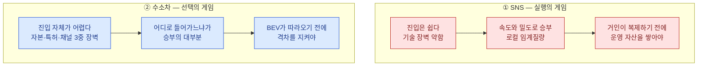

# 신규 진입자 KSF 비교 — 위치기반 숏폼 SNS ↔ 수소연료전지 승용차

> Top 5 원본: [KSF (기업 사례 포함)](./ksf-top5-new-entrant-with-cases.md)
> 선행 분석: [Five Forces – 분석①](../porters-five-forces/porters-five-forces-analysis-location-sns.md) · [분석②](../porters-five-forces/porters-five-forces-analysis-hydrogen-passenger-ev.md) · [Five Forces 비교](../porters-five-forces/porters-five-forces-comparison-location-sns-vs-hydrogen-passenger-ev.md) · [가치사슬 비교](../value-chain/value-chain-comparison-sns-vs-hydrogen-ev.md)

## 0. 왜 KSF 목록을 합치지 않았는가

두 시장은 Five Forces에서 정반대의 이유로 신규 진입자에게 유리하지 않다. ①은 다섯 힘이 전부 강해 이익이 깎이는 **과밀형**(산업 매력도 낮음)이고, ②는 진입장벽이 높아 매력도가 "중간(조건부)"로 나왔지만 그 조건이 BEV라는 압도적 대체재를 계속 따돌리는 것이어서 실질적으로는 매력이 불안정한 **초기 고정형**이다.

가치사슬 비교는 이 차이를 활동 수준에서 이미 확인했다 — ①은 사슬의 **출구**(마케팅·서비스)에서 신뢰·확산이라는 무형 자산이 새어 나가고, ②는 사슬의 **입구·중간**(조달·산출물류)에서 희소자원과 충전 인프라라는 물리적 제약에 걸려 넘어진다.

원인이 반대이므로 성공 요인도 반대다. **하나의 Top 5로 합치면 어느 쪽에도 맞지 않는 일반론이 된다.** 두 목록을 나란히 놓았을 때 비로소, KSF라는 것이 산업 구조에서 어떻게 도출되는지가 드러난다.

---

## 1. Top 5 대조표

> B(수소차)는 원본 KSF 순서를 재배열했다 — "완성차 회피"가 나머지 네 KSF를 성립시키는 전제이므로 1순위로 옮긴다.

| 순위 | ① 위치기반 숏폼 SNS | 성격 | ② 수소연료전지 승용차 | 성격 |
|---|---|---|---|---|
| 1 | 하이퍼로컬 임계질량 우선 확보 | 진입조건 | 개인 승용차 대신 플릿 세그먼트 우선 공략 | 진입조건 |
| 2 | 대기업 기능 복제에 대비한 방어 가능한 해자 설계 | 생존전제 | 완성차-에너지기업 합작을 통한 생태계 동시 구축력 | 진입조건 |
| 3 | 크리에이터 멀티호밍에 대응하는 리텐션 투자 | 생존전제 | 희소금속(백금) 의존을 낮추는 촉매 기술 R&D | 성장요인 |
| 4 | 광고 의존을 벗어난 수익모델 전환(로컬 커머스) | 성장요인 | BEV 대비 충전시간·주행거리 격차 유지 기술 | 생존전제 |
| 5 | "시간 점유" 경쟁을 피하는 좁은 니즈 포지셔닝 | 성장요인 | 정부 정책 로드맵과의 선제적 정합 | 생존전제 |

---

## 2. 핵심 대비 네 가지

### ① 1순위 KSF가 둘 다 "정면으로 들어가지 마라"이다

| | ① SNS | ② 수소차 |
|---|---|---|
| 1순위 KSF | 하이퍼로컬 임계질량 우선 확보 | 플릿 세그먼트 우선 공략 |
| 실질적 명령 | **전국으로 넓히지 마라** | **개인 승용차로 들어가지 마라** |
| 근거가 된 판정 | 신규 진입 위협 항목의 "네트워크 효과가 로컬로 쪼개져 있다" + 대체재 위협 매우 높음 | 대체재 위협 "매우 높음, 상용차 대비 더 심화" — 개인 소비자가 플릿 운영사보다 BEV에 훨씬 민감 |

> 📌 매력도가 낮은 산업에서 신규 진입자의 1순위 성공 요인은 언제나 **"어디를 포기할 것인가"**로 나타난다. 자원이 한정된 진입자는 정면에서 이길 수 없으므로, 전략은 무엇을 하느냐가 아니라 어디를 비우느냐에서 시작된다.

### ② 그러나 게임의 성격이 다르다 — 실행의 게임 vs 선택의 게임

| | ① SNS | ② 수소차 |
|---|---|---|
| 승부가 결정되는 시점 | **진입 후** — 실행 속도와 운영 품질 | **진입 전** — 어느 구간으로 들어갈지 정하는 순간 |
| KSF의 성격 | 대부분 **조직 역량** (밀도 확보, 크리에이터 리텐션, 프라이버시 대응) | 대부분 **포지션 선택과 파트너십** (세그먼트, 합작 구조) |
| 잘못된 선택의 회복 가능성 | 있다 — 지역을 바꿔 다시 시도 가능 | 거의 없다 — 설비·인증·파트너십에 자본이 묶인다 |
| 필요한 조직 문화 | 빠른 시도와 회수 | 사전 검증과 파트너십 축적 |

> 📌 이는 가치사슬 비교의 결론 — ①의 병목은 사슬의 출구(무형 자산), ②의 병목은 사슬의 입구·중간(물리 제약) — 이 신규 진입자 관점에서 다시 확인된 것이다. 무형 자산의 병목은 실행으로 풀리고, 물리 제약의 병목은 위치(진입 지점)를 바꿔야 풀린다.

### ③ 시간축이 다르므로 '실패'의 정의가 다르다

| | ① SNS | ② 수소차 |
|---|---|---|
| 생존 판정 주기 | 첫 지역에서 밀도를 못 만들면 비교적 빠르게 신호가 나옴 | 시장이 열릴 때까지 버티는 것 자체가 과제 |
| 죽는 원인 | 밀도 없는 확장으로 인한 크리에이터·광고주 이탈 | 시장 개화 이전의 현금 고갈, 정책 의존 심화 |
| 관련 KSF | 크리에이터 리텐션 투자, 좁은 니즈 포지셔닝 — *빨리 방어 자산을 쌓기* | 정책 로드맵 정합, BEV 격차 유지 — *오래 버티기* |
| 위험한 성공 신호 | 다운로드 수 증가 (밀도 없는 확장) | 보조금 기반 초기 수주 (정책 의존 심화) |

> 📌 ①의 신규 진입자에게 시간은 **적**이다. 거인이 복제하기 전에 운영 자산을 쌓아야 한다. ②의 신규 진입자에게 시간은 **조건**이다. 시장이 열리는 시점이 정책·인프라라는 외부 변수에 달려 있으므로, 그때까지 살아 있는 것 자체가 전략이다.

### ④ Five Forces의 '진입자 위협' 판정이 KSF 도출로 뒤집힌다

이 비교에서 가장 중요한 발견이다.

| | Five Forces 판정 | KSF 도출 후 |
|---|---|---|
| ① SNS | 신규 진입자 위협 **높음** — 규모의 경제·특허·채널 3요소가 전부 약해 누구나 들어올 수 있다 | 들어가기는 쉽지만 **살아남기가 극히 어렵다.** KSF 5개 중 2개(해자 설계, 크리에이터 리텐션)가 진입 이후 방어에 관한 것 |
| ② 수소차 | 신규 진입자 위협 **낮음** — 규모의 경제·특허·채널 3요소가 전부 강한 장벽, "생태계 전체가 동시에 갖춰져야" 진입 가능 | **진입 지점을 바꾸면 장벽이 성립하지 않는다.** 개인 승용차 완성차 레이어에서는 장벽이 높지만, 플릿 세그먼트나 소재·촉매 공급 레이어에는 조 단위 설비가 필요 없다 |

> ⚠️ **핵심 포인트.** *'진입자 위협 높음'*이 *'진입하기 쉽다'*를 뜻하지 않고, *'진입자 위협 낮음'*이 *'진입이 불가능하다'*를 뜻하지 않는다. Five Forces의 진입 장벽 판정은 **분석자가 어떤 진입 지점을 상정했느냐에 종속**된다. ②의 장벽이 높게 나온 것은 [분석②의 "0. 분석 단위 설정"](../porters-five-forces/porters-five-forces-analysis-hydrogen-passenger-ev.md)이 분석 주체를 "개인 소비자 대상 완성차 업체"로 못 박았기 때문이며, 층위를 상용차 플릿이나 소재 공급으로 바꾸면 판정도 바뀐다.
>
> 이것이 KSF 분석이 Five Forces 다음에 와야 하는 이유다. **KSF를 도출하는 과정에서 비로소 진입 지점을 재정의하게 되고, 그 결과 앞선 판정이 수정된다.**

---

## 3. 신규 진입자를 위한 최종 권고

| | ① 위치기반 숏폼 SNS | ② 수소연료전지 승용차 |
|---|---|---|
| **진입 권고 여부** | **조건부 권고** — 지역을 좁힐 각오가 있을 때만 | **개인 승용차 완성차는 비권고**, 플릿·소재 레이어는 권고 |
| **진입 지점** | 하나의 대학·지역·활동 커뮤니티 | 상용차·물류 플릿 세그먼트, 또는 백금 대체 촉매 소재 공급 |
| **첫 12개월에 할 일** | 목표 지역에서 임계밀도 확보 + 대기업이 흡수하기 어려운 니치(가족·안전·특정 활동) 기능 설계 | 에너지 기업과의 파트너십 체결, 플릿 파일럿 확보, 촉매 절감 기술 실증 |
| **첫 12개월에 하지 말 것** | 두 번째 지역으로 조기 확장, 순수 광고 수익화에만 의존 | 개인 승용차 완성차 설비 투자, 보조금 기반 대량 수주 추진 |
| **실패 신호** | 다운로드는 늘지만 지역별 활성 밀도가 정체, 크리에이터 이탈률 상승 | 매출이 전부 보조금 기반이고 기술 라이선싱·플릿 수요가 없음 |
| **철수 판단 기준** | 첫 지역에서 12~18개월 내 임계밀도 미달 | 보조금 중단 시나리오에서 12개월 미만 runway |

---

## 4. 이 비교에서 남는 교훈

1. **KSF는 산업 구조에서 도출되는 것이지, 일반론에서 오는 것이 아니다.** *'좋은 팀'*이나 *'차별화된 제품'*은 어느 산업에나 해당하므로 KSF가 아니다. 두 시장의 Top 5가 단 하나도 겹치지 않았다는 사실이 이를 증명한다.

2. **매력도가 낮은 산업일수록 1순위 KSF는 '무엇을 포기할 것인가'로 나타난다.** 자원이 한정된 신규 진입자가 정면에서 이길 방법은 없으므로, 전략은 비우는 데서 시작한다.

3. **KSF의 성격을 구분해야 자원 배분이 가능해진다.** 시작 전에 정해지는 **진입조건**, 못하면 죽는 **생존전제**, 잘하면 이기는 **성장요인**은 각각 다른 시점에 다른 자원을 요구한다. 섞어서 나열하면 우선순위가 무너진다.

4. **선행 분석의 판정은 KSF 도출 과정에서 수정될 수 있다.** ②의 '신규 진입자 위협 낮음'은 분석 단위를 개인 승용차 완성차로 잡았을 때의 결론이었고, 진입 지점을 플릿·소재 레이어로 바꾸자 성립하지 않았다. **프레임워크의 결론은 분석 단위에 종속된다는 원칙이 여기서 다시 확인된다.**

5. **다음으로 남는 질문.** KSF는 *"무엇에 집중해야 하는가"*를 알려주지만, *"그 집중이 얼마나 큰 시장을 여는가"*는 답하지 못한다. ①의 '하나의 대학가'와 ②의 '플릿·소재 레이어'가 각각 사업이 될 만한 크기인지는 아직 모른다. 다음 단계로는 TAM-SAM-SOM 같은 시장 규모 추정 분석이 자연스러운 후속 작업이 될 수 있다.
