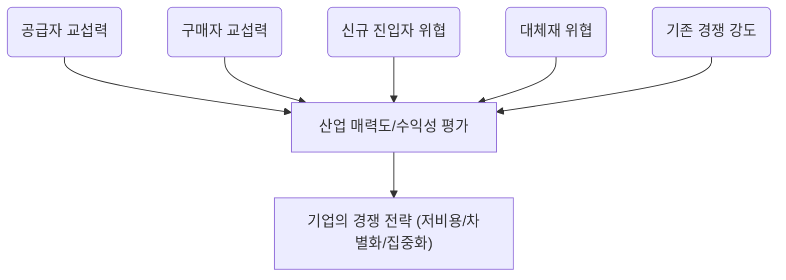

# 01 - Porter's Five Forces 모델

Porter's Five Forces Analysis Tutorial

> **"내 비즈니스가 속한 필드가 돈이 될까?"**를 알려주는 마법의 돋보기가 바로 포터의 5가지 힘 분석 모델입니다.
이 모델은 우리가 어떤 산업에 뛰어들 때, 그 산업의 **수익성**을 미리 점쳐보고 성공적인 **전략**을 세우는 데 결정적인 도움을 줍니다.
결국, 이 5가지 힘을 꽉 잡아야 경쟁에서 이기고 돈을 벌 수 있다는 거죠.

## 1. 포터의 5가지 힘: 비즈니스의 '주변 환경' 탐색

- 이 분석은 단순히 우리 회사 내부만 보는 게 아니라, 우리가 속한 **산업 전체**의 매력을 평가하는 도구예요.
- 마치 부동산을 살 때 집의 내부뿐만 아니라 동네의 치안, 교통, 학군을 모두 살펴보는 것과 비슷하죠.
- 핵심은 **산업 자체가 얼마나 돈이 잘 되는 구조인지**를 다섯 가지 관점으로 쪼개보는 것입니다.
- 이 분석을 통해 기업은 어떤 시장에서 싸워야 할지, 그리고 어떻게 자리를 잡아야 할지 **전략적 판단**을 내릴 수 있게 됩니다.

## 2. 경쟁의 5가지 근원: 이들을 파악해야 성공한다

- 포터 교수는 산업 내 경쟁이 일어나는 근본적인 이유가 딱 다섯 가지라고 정리했어요.
- 이 다섯 가지 힘이 **강할수록** 그 산업은 돈 벌기가 어렵고, **약할수록** 수익성이 높다는 뜻입니다.
- 이 다섯 가지 힘을 이해하면 기업은 시장의 **경쟁 강도**와 **매력도**를 한눈에 파악할 수 있어요.
- 다섯 가지 힘은 공급자의 힘, 구매자의 힘, 신규 진입자의 위협, 대체재의 위협, 그리고 **기존 경쟁자** 간의 싸움입니다.

### 1) 공급자의 힘: 재료 수급 물목의 보유자들

- 공급자(원재료나 부품을 주는 사람)가 우리에게 콧대를 세울 수 있는지를 보는 힘이에요.
- 만약 우리 제품 원가의 **대부분을 그들의 재료**가 차지한다면 그들은 갑이 될 수밖에 없죠.
- 또, 그들이 파는 물건을 다른 회사에서 구하기 **너무 어렵거나** 바꿀 때마다 큰 **추가 비용**이 든다면 힘이 세집니다.
- 이들은 우리 회사를 건너뛰고 우리 고객에게 직접 팔 수도(전방 통합) 있어서 더 무섭죠.

### 2) 구매자의 힘: 가격 흥정의 달인들

- 구매자(우리가 만든 물건을 사주는 고객)가 가격을 마구 깎아내리거나 품질을 높이 요구할 수 있는지 분석하는 거예요.
- 만약 우리 회사 제품을 사는 **큰 손님**이 소수라면, 그들은 가격 협상에서 우위를 점하기 쉽습니다.
- 우리가 만든 제품이 **너무 흔해서** (표준화되어 있어서) 고객이 다른 곳에서 쉽게 사 올 수 있다면 힘이 강해지죠.
- 반대로, 고객이 우리 회사를 **바꾸는 데 드는 노력(전환 비용)**이 크다면 그들의 힘은 약해집니다.

### 3) 신규 진입자의 위협: 시장을 노리는 잠재적 경쟁자들

- 아직 우리 시장에 들어오지 않았지만, 언제든 **문 부수고 들어와서** 시장 파이를 뺏어갈 수 있는 잠재적 경쟁자에 대한 경계심입니다.
- 이들의 위협 수준은 **진입 장벽(Barrier to Entry)**이 얼마나 높은가에 달려 있어요.
    - 규모의 경제: 회사가 커질수록 물건 하나 만드는 단가가 싸지면, 작은 신규 업체는 따라오기 힘들어요.
    - 기술적 우위나 특허: 독점 기술이 있으면 남들이 따라 하기 어렵습니다.
    - 채널 확보: 이미 좋은 유통망이나 브랜드 평판을 선점했다면 신규 업체가 비집고 들어오기 어렵습니다.

### 4) 대체재의 위협: '완전히 다른 것'의 습격

- 대체재는 우리 제품과 **완전히 다른 종류**이지만, 고객의 **같은 욕구**를 채워줄 수 있는 것을 말해요.
- 예를 들어, KTX의 대체재는 비행기일 수도 있지만, '빨리 이동하고 싶다'는 욕구 충족에서는 자동차도 넓은 의미의 대체재가 될 수 있어요.
- 대체재가 너무 좋거나 싸게 등장하면, 우리 제품 가격을 올리기 힘들어지거나 품질 개선 압박을 받게 됩니다.
- 고객이 **쉽게 대체재로 갈아탈 수 있다면** (전환 비용이 낮다면) 이 위협은 더욱 커집니다.

### 5) 산업 내 경쟁 강도: 치열한 내부 싸움

- 같은 시장에서 이미 활동 중인 경쟁사들끼리 피 튀기는 싸움을 하는 정도를 의미해요.
- 이 경쟁은 주로 **가격 인하, 광고, 신제품 출시** 등으로 나타나며 서로의 이익을 깎아내리죠.
- 경쟁이 심해지는 주된 이유는 시장이 성장 정체기에 접어들었거나, 경쟁사들이 너무 많을 때 발생합니다.
- 결국 이 내부 경쟁이 치열하면, **산업 전체의 평균 수익률**은 낮아지게 됩니다.

## 3. 5가지 힘의 관계 - 전체 구조도로 파악하기

- 이 다섯 가지 힘은 서로 분리된 것이 아니라, 복잡하게 얽혀 산업의 수익성을 결정해요.
- 이 모델은 **"우리가 어느 산업에서 싸울지"**를 결정하는 데 최적화된 도구입니다.
- 분석 후에는 우리 회사의 **자원**과 산업의 매력도를 비교하여 전략을 짜야 해요.
- 전략은 고정된 것이 아니라 시장 변화에 따라 **유연하게 조정**되어야 하므로, 이 분석은 주기적인 피드백 과정이 필요합니다.



## Porter's Five Forces 분석 보고서 작성 실습: 2개 이상의 시장 영역에 대해서 작성하고 비교해보기!

*아래 예시리스트 중 2개를 선택하거나 기타 본인이 원하는 다른 영역이 있다면 추가로 자유롭게 선택*

### 산업분야 및 시장영역 예시 리스트

| 산업 분야 | 시장 영역 (예시) |
| --- | --- |
| **기술 및 통신** | 스마트폰 시장 (삼성, 애플) |
|  | 클라우드 컴퓨팅 (AWS, Azure) |
|  | 소셜 미디어 플랫폼 (인스타그램, 틱톡) |
|  | 온라인 동영상 스트리밍 (넷플릭스, 디즈니+) |
| **소매 및 소비재** | 대형마트 및 할인점 (이마트, 코스트코) |
|  | 패스트푸드 산업 (맥도날드, 버거킹) |
|  | 커피 전문점 (스타벅스, 투썸플레이스) |
|  | 온라인 쇼핑몰 (쿠팡, 아마존) |
| **제조 및 운송** | 자동차 산업 (현대차, 테슬라) |
|  | 항공 산업 (대한항공, 델타항공) |
|  | 조선업 (HD현대중공업, 삼성중공업) |
|  | 반도체 산업 (삼성전자, TSMC) |
| **서비스 및 기타** | 은행 및 금융 서비스 (KB국민은행, 카카오뱅크) |
|  | 제약 산업 (화이자, 셀트리온) |
|  | 호텔 및 숙박업 (힐튼, 에어비앤비) |
|  | 게임 산업 (라이엇 게임즈, 닌텐도) |
|  | 교육 서비스 (메가스터디, Coursera) |
|  | 음료 시장 (코카콜라, 펩시) |
|  | 의류 및 패션 산업 (나이키, 자라) |
|  | 영화 및 엔터테인먼트 (CJ ENM, 디즈니) |

> **주의**: 시장 영역 명칭을 위에 있는 그대로 쓰지 말고, 더 구체적인 관심사를 적용해 좁힌 후 분석합니다!!
>
> ex) 소셜미디어플랫폼 X → 이미지 & 숏폼 영상 중심의 SNS O
>       자동차 산업 X → 미래형 수소 배터리 전기차 산업 O

### 분석 프롬프트

```
지금부터 포터의 다섯가지 힘 분석을 연습하려고 해
내가 따르고자 하는 분석 방법론은 아래와 같아

---
[상기한 분석 방법론 붙여넣기!]
---

위 분석방법론을 먼저 마크다운 파일로 저장한 후에 나에게 분석할 대상 시장 영역을 2가지 영역으로 물어봐줘.
각각 분석 후 비교하고 싶어서 그래.
```

### `*개인적인 서비스 아이디어가 있는 경우` 아래 방식으로 시장영역 추출!

: 나의 비즈니스 기획 초안을 작성한 뒤, 해당 비즈니스 기획이 속한 시장 영역을 선택

**비즈니스 기획 초안 작성을 위한 프롬프트 예제 (PARTS+C)**

```yaml
Persona : 당신은 전문 비즈니스 기획자이다. 당신은 고도한 비즈니스 감각을 갖추고 있으며, 사업적으로 중요한 부분에 대해서 명시적으로 언급되지 않고 암시적으로 제시되는 부분까지 빠짐없이 파악하고 그것을 요약적으로 제시하는 최고 수준의 문서화 능력을 가지고 있다.

Aim : 당신이 지금 작업할 내용은 아래 Context 섹션에 제시된 내용과 맥락을 기반으로 "{YOUR BUSINESS TITLE HERE} 서비스"를 제작 및 운영하기 위한 비즈니스 기획서의 초안을 작성하는 것이다. 아래 Context 섹션에 제시된 자료의 명세는 {YOUR CONTEXT REFERENCING MATERIALS TITLE HERE}와 같다. 이와 같은 구체적인 맥락과 콘텐츠 방향성을 기반으로 사업 계획의 아웃라인을 작성하라.

Reciepients : 대상 독자는 후속 비즈니스 분석을 수행할 사업 기획자 또는 경영자, 비즈니스 분석에 특화된 AI 에이전트 등이다.

Theme : 작성할 비즈니스 기획서의 기본 방향은, 이것이 비즈니스를 설계하는 극초반 단계의 문서라는 것을 염두에 두고 다양한 사업적 선택 방향에 대해서 아직 열려있다는 것을 전제하는 것이다. 예를 들면, 기획하고 있는 사업 주제 및 유형에 적합한 수익구조(BM)의 종류를 여러가지 제시해주고, 관련 사업 및 서비스에는 어떤 것들이 있는지 예시도 함께 제시해 주는 등이다.

Structure : 비즈니스 기획서는 "Business One-Pager" 형태로 작성하고, 추가로 작성할 내용이 있다면 문서의 구성을 확장하라. 개조식으로 작성하되, 정확한 의미전달을 위해서 완전한 문장이 필요한 곳에는 반드시 완전한 문장을 사용해야 한다. 예의바른 어미를 사용하되, 절대로 내용 전달에 불필요한 단어를 추가하면서까지 예의를 차리지는 말아야 한다.

Context: {YOUR CONTEXT HERE}
---
자 그럼 이제 작업을 시작하자.
```

- Context 부분은 파일로 처리해도 좋습니다.
- 내용 구성만 잘 갖춰져 있다면 PARTS+C 의 각 항목 레이블은 없어도 됩니다.
- 위 예제에서 아래 세개의 칸을 여러분의 비즈니스 주제 및 자료로 채워야 합니다
    - {YOUR BUSINESS TITLE HERE}
    - {YOUR CONTEXT REFERENCING MATERIALS TITLE HERE}
    - {YOUR CONTEXT HERE}
- 아이디어의 구체성에 따라 여기에서 나오는 비즈니스 기획서가 천차만별일 수 있습니다.
- 이 기획서 초안과 나중에 정리된 서비스 내용이 달라지므로 이 초안은 임시로만 사용합니다.

### 보고서 출력 결과 비교

- 2개 이상의 시장 영역 비교
- 기획서 초안 첨부 여부에 따른 비교
