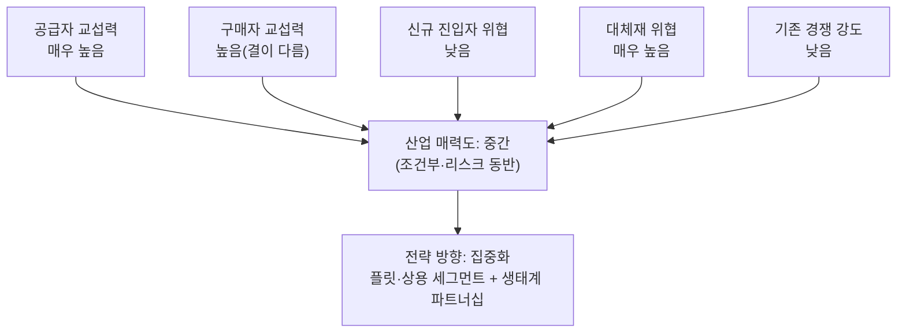

# 분석 ② — 미래형 수소 배터리 전기 승용차

> [분석 방법론](./porters-five-forces-methodology.md)에 따른 Porter's Five Forces 분석
> 비교 대상: [분석 ① — 위치기반 SNS](./porters-five-forces-analysis-location-sns.md) · [비교 분석](./porters-five-forces-comparison-location-sns-vs-hydrogen-passenger-ev.md)

## 0. 분석 단위 설정

| 항목 | 설정 |
|---|---|
| 분석 주체 | 개인 소비자 대상 수소연료전지 승용차를 제조·판매하는 **완성차 업체** (상용차·버스 등 B2B 플릿은 제외) |
| 수익 모델 | 차량 판매(완성차 마진) 중심, 일부 A/S·충전 제휴 수익 |
| 지역·시점 | 국내 시장, 2026년 현재 |
| 참고 사례 | 현대 넥쏘, 토요타 미라이, 혼다 클래리티(생산 중단) |

⚠️ 여기서 "구매자"도 두 종류다. **차를 직접 사는 개인 소비자**와 **보조금·인증 정책을 쥔 정부**. 정부는 구매자이자 동시에 규제자라는 이중적 지위를 가지므로, 이 둘을 섞으면 구매력의 실체를 놓친다.

---

## 1) 공급자의 힘 — **매우 높음**

공급자를 층으로 쪼개면 위치기반 SNS보다 더 물리적이고 되돌리기 어려운 의존이 드러난다.

| 공급자 층 | 힘 | 근거 |
|---|---|---|
| **희소금속** (백금 촉매) | 매우 강함 | 남아공 등 특정 지역에 매장이 편중되어 지정학적 리스크가 그대로 원가에 전이된다. 대체 원료가 거의 없어 협상 자체가 성립하지 않는다. |
| **연료전지 스택 제조사** | 강함 | 발라드파워 등 핵심기술 보유사가 소수다. 방법론의 *"바꾸는 데 큰 추가 비용이 든다"*가 문자 그대로 적용되는 부품 — 스택을 바꾸면 차량 설계 자체를 다시 해야 한다. |
| **수소 저장탱크** (탄소섬유) | 강함 | 고압수소를 견디는 안전 인증까지 통과해야 해 벤더 풀이 극히 작다. |
| **수소 생산·충전 인프라 사업자** (정유사, 가스공사, 에너지 기업) | 강함 | 완성차 판매량과 무관하게 이들의 인프라 투자 속도가 실질 판매 가능 지역을 결정한다. 완성차 업체가 협상력을 가질 수 없는, **산업 밖에서 결정되는 공급자**다. |

> 📌 **전방 통합의 위협도 실재한다.** 에너지 기업이 수소버스·모빌리티 서비스를 직접 운영하며 완성차 업체를 건너뛸 잠재력이 있다. 방법론 1)의 마지막 항목이 그대로 적용된다.

---

## 2) 구매자의 힘 — **높음, 단 결이 다름**

### 개인 소비자 (실사용자)
- 충전소가 절대적으로 부족해 실사용 불편이 크고, 대안(BEV·내연차)이 이미 충분히 존재해 "안 사도 그만"인 시장이다.
- 전환비용은 사실상 "그냥 다른 차를 사는 것"과 같아 거의 0에 가깝다.
- → **매우 강함**

### 정부·공공조달 (보조금 집행 주체이자 규제자)
- 초기 수요의 상당 부분을 정부 보조금·공공조달이 견인하고 있어, 실질 구매력이 정책 방향에 종속되어 있다.
- 구매자이면서 동시에 인증·안전 규제를 쥔 규제자이므로, 방법론이 말하는 순수한 "가격 흥정"과는 성격이 다르다.
- → **정책이 곧 구매력** — 강함이지만 시장 논리가 아니라 정치적 논리로 움직임

---

## 3) 신규 진입자의 위협 — **낮음**

진입 장벽을 방법론의 3요소로 점검하면 위치기반 SNS와 정반대로 전부 높게 나온다.

| 장벽 요소 | 평가 |
|---|---|
| 규모의 경제 | **강함(장벽)** — 연료전지 양산·품질관리에 막대한 CAPEX가 필요해 소량 생산으로는 단가가 나오지 않는다. |
| 기술적 우위·특허 | **강함(장벽)** — 연료전지 핵심 특허를 소수 기업이 선점하고 있다. |
| 채널·브랜드 선점 | **강함(장벽)** — 기존 완성차의 딜러망과 정부 인증 이력을 신규 업체가 처음부터 새로 쌓아야 한다. |

**이 산업의 진짜 장벽은 "생태계 전체"가 동시에 갖춰져야 한다는 점이다.** 차량, 충전소, 정비망 중 하나만 빠져도 나머지가 무용해진다. 그래서 실제 진입 경로는 신생 스타트업이 아니라 **기존 완성차와 에너지 대기업의 합작**으로 나타난다 — 혼자서는 가치사슬을 완결할 수 없기 때문이다.

---

## 4) 대체재의 위협 — **매우 높음**

고객의 욕구를 갈래로 분해하면, 수소차의 존재 이유 자체가 좁아지고 있다.

| 충족하려는 욕구 | 대체재 |
|---|---|
| 친환경 이동 | 배터리 전기차(BEV) — 충전 인프라·원가 하락 속도에서 압도적 우위 |
| 저비용 이동 | 중고 내연기관차, 하이브리드, 대중교통 |
| 빠른 충전 + 장거리(수소차의 유일한 소구점) | BEV 급속충전·800V 아키텍처 발전으로 이 격차마저 빠르게 좁혀지는 중 |

특히 첫 번째가 치명적이다. BEV는 "친환경 이동"이라는 동일한 욕구를 이미 표준에 가까운 지위로 충족하고 있고, 소비자에게 전환비용은 "그냥 다른 친환경차를 사는 것"일 뿐이다 — 방법론의 *"대체재가 너무 좋거나 싸게 등장하면 품질 개선 압박을 받는다"*가 정확히 이 산업을 겨냥한 문장처럼 읽힌다.

---

## 5) 산업 내 경쟁 강도 — **낮음**

- 현재 개인용 수소 승용차를 실제 판매하는 완성차는 현대·토요타 등 극소수라, 경쟁이라 부르기 어려운 단계다.
- 경쟁 수단이 가격 인하가 아니라 **존재를 알리고 생태계를 함께 키우는 것**으로 나타난다 — 충전 규격·안전 인증 표준화에 협력하는 양상이 오히려 경쟁보다 두드러진다.
- 시장 자체가 아직 형성 단계라 방법론이 말하는 *"성장 정체기"* 조건과는 정반대다 — 다만 이는 경쟁이 없어서가 아니라 시장이 작아서다.

---

## 종합: 산업 매력도 **중간(조건부)** — 초기 고정형

낮은 경쟁강도와 높은 진입장벽만 보면 매력적이지만, 그 매력은 **BEV라는 대체재를 계속 따돌릴 수 있다는 전제** 위에서만 성립한다. 이 전제가 흔들리면 높은 진입장벽은 지켜줄 시장이 없는 좌초자산으로 반전된다.

## 전략 시사점

| 방향 | 내용 |
|---|---|
| **집중화** (권장) | 개인 승용차 전면전은 시기상조. 고정 노선·거점 충전으로 인프라 제약을 우회할 수 있는 **상용차·버스·물류 플릿** 세그먼트에 먼저 집중하고, 승용차는 생태계 쇼케이스로 취급. |
| **차별화** (조건부 권장) | 충전시간·주행거리라는 유일한 소구점을 지키는 기술 개발이 곧 생존 조건. 다만 BEV의 발전 속도가 이 차별화의 유효기간을 계속 깎아낸다. |
| **저비용** (비권장) | 백금 등 희소금속 의존과 소수 공급자 구조상 원가 우위 확보가 근본적으로 어렵다. |
| *(보조) 생태계 파트너십* | 위 셋의 전제조건. 완성차 단독으로는 충전 인프라·수소 생산까지 갖출 수 없으므로, 에너지 기업·정부와의 파트너십 구축력 자체가 진입 여부를 가르는 축이다. |
