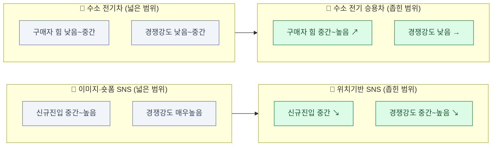

# Porter's Five Forces 비교 분석: 위치기반 이미지·숏폼 SNS vs. 수소 배터리 전기 승용차

> 이전 분석(`이미지·숏폼 SNS` / `수소 배터리 전기차`)보다 범위를 더 좁힌 버전. "위치기반"과 "승용차"라는 조건이 추가되면서 다섯 가지 힘의 강도가 어떻게 달라지는지에 초점.

### 🖼️ 한눈에 보기 — 범위를 좁혔을 때 힘의 세기가 어떻게 이동했는가

| 힘 | 넓은 범위 (SNS 전체 / 수소차 전체) | 좁힌 범위 (위치기반 / 승용차) | 이동 방향 |
| --- | :---: | :---: | :---: |
| 🔧 공급자 | ●●●○○ 중간 | ●●●◐○ 중간~높음 | ↗ 소폭 강화 |
| 💰 구매자 | ●●●●● 매우 높음 → ●●◐○○ 낮음~중간 | ●●●●● 매우 높음(결이 다름) → ●●●◐○ 중간~높음 | ↕ SNS 유지 / 수소차 ↗ 강화 |
| 🚪 신규진입 위협 | ●●●◐○ 중간~높음 → ●●○○○ 낮음 | ●●●○○ 중간 → ●●○○○ 낮음 | ↘ SNS 완화 / 수소차 유지 |
| 🔄 대체재 위협 | ●●●●● 매우 높음 (둘 다) | ●●●●● 매우 높음, 내용은 더 심화 | → 유지, 단 압력 원인 추가 |
| ⚔️ 경쟁강도 | ●●●●● 매우 높음 → ●●◐○○ 낮음~중간 | ●●●◐○ 중간~높음 → ●●○○○ 낮음 | ↘ SNS 완화 / 수소차 유지 |

## 1. 이미지 & 숏폼 영상 중심의 위치기반 SNS

- **산업 정의**: 사용자의 현재 위치를 중심으로 이미지·숏폼 영상을 노출·공유하는 SNS (예: 스냅맵형 위치 공유, 동네 기반 숏폼 피드).

### 공급자의 힘 — 중간~높음
- 앱스토어 수수료 구조는 일반 SNS와 동일하게 강한 공급자로 작동.
- 추가로 **위치·지도 API 공급자**(구글맵, 국내는 카카오맵·네이버지도)에 대한 의존이 생김 — 일반 SNS에는 없는 공급자 축이 하나 더 추가됨. API 가격 정책 변경이 곧바로 원가에 반영되는 구조.

### 구매자의 힘 — 매우 높음, 단 결이 다름
- 사용자: 여전히 무료·저전환비용이지만, 하이퍼로컬 네트워크 효과 특성상 "내 동네에 친구가 없으면 무의미" — 임계질량 확보는 더 어렵지만, 확보되면 지역 커뮤니티 단위 이탈장벽이 형성됨.
- 광고주: 하이퍼로컬 타겟팅(동네 상권 광고)이 가능해, 대체 채널이 마땅치 않은 지역 소상공인 광고주에 한해서는 일반 SNS보다 협상력이 다소 낮아짐.

### 신규 진입자의 위협 — 중간
- 일반 SNS보다 오히려 **진입장벽이 낮음**: 글로벌 임계질량 대신 특정 도시·상권·대학가 하나에서만 임계질량을 만들면 되는 침투 전략이 가능.
- 다만 지도 데이터·위치 인프라 구축비는 일반 SNS 대비 추가 비용.
- 대형 플랫폼이 위치 기능을 부가기능으로 흡수하는 위협은 동일하게 존재(인스타그램 위치 태그 강화 등).

### 대체재의 위협 — 매우 높음
- attention economy 전체가 대체재라는 점은 동일.
- 추가로 **위치 정보 없는 일반 숏폼 SNS 자체가 대체재**가 됨 — 위치 공유가 핵심가치로 느껴지지 않으면 프라이버시 우려로 사용자가 이탈할 유인이 큼.

### 기존 경쟁 강도 — 중간~높음
- 위치기반 SNS는 아직 뚜렷한 승자가 없는 파편화된 영역이라, 3강 구도인 일반 숏폼 SNS보다 정면 경쟁 강도는 낮음.
- 다만 "위치"라는 차별점이 대형 플랫폼의 부가기능으로 쉽게 흡수될 수 있어 독자 생존 명분이 약함.

**종합**: 일반 SNS보다 진입장벽이 낮고 정면 경쟁도 덜하지만, 차별화 요소(위치)가 대기업 부가기능으로 흡수되기 쉬워 해자가 얕음. 위치정보 관련 규제(개인정보보호법)가 추가 리스크.

---

## 2. 미래형 수소 배터리 전기 승용차 산업

- **산업 정의**: 상용차·버스 등 B2B 플릿이 아닌, 개인 소비자가 구매하는 수소연료전지 승용차 시장으로 한정.

### 공급자의 힘 — 높음
- 백금 촉매 등 희소자원 의존, 연료전지 핵심기술 소수 보유 구조는 상용차 세그먼트와 동일.

### 구매자의 힘 — 중간~높음 (상용차 대비 확연히 강해짐)
- 상용차·버스는 고정 노선·거점 충전소로 운영이 가능하지만, 개인 승용차는 전국 어디서나 충전 가능해야 하는데 수소충전소가 절대적으로 부족 — 실사용 불편이 구매 자체를 포기하게 만듦.
- 실제 구매를 고려하는 소비자에게는 대안(BEV, 내연차)이 이미 충분히 존재해 협상력이 강함 — "안 사도 그만"인 시장.
- 결과적으로 **상용차 세그먼트보다 구매자 힘이 더 높음**: 개인은 인프라 불편을 감수할 유인이 사업자보다 훨씬 적음.

### 신규 진입자의 위협 — 낮음
- R&D·특허·인프라 자본 요구, 안전 규제 장벽은 상용차와 동일하게 높음.

### 대체재의 위협 — 매우 높음, 상용차 대비 더 심화
- BEV는 개인용 승용차 시장에서 이미 표준에 가까운 지위(가정 충전, 급속충전망 확대) — 승용차 세그먼트일수록 BEV 대체 압력이 더 직접적.
- 개인 소비자는 "집에서 충전 가능한 BEV" vs "충전소를 찾아다녀야 하는 수소차"의 편의성 격차를 플릿 운영사보다 훨씬 민감하게 체감.

### 기존 경쟁 강도 — 낮음
- 개인용 수소 승용차를 실제 판매하는 완성차는 현대 넥쏘, 토요타 미라이 등 극소수 — 경쟁이라 부르기 어려운 단계.

**종합**: **상용차 세그먼트보다 산업 매력도가 오히려 낮음.** 진입장벽은 여전히 높지만, 개인 소비자의 대체재 전환 유인이 플릿 운영사보다 훨씬 강해 시장 자체가 형성되기 어려운 구조. 승용차 부문은 수소 생태계의 "쇼케이스"에 가깝고, 실질적 수익성은 상용차·충전 인프라 부문에서 나올 가능성이 큼.

---

## 3. 비교 요약

| 힘 | 위치기반 SNS | 수소 전기 승용차 |
| --- | --- | --- |
| 공급자 | ●●●◐○ 중간~높음 (지도 API 추가) | ●●●●○ 높음 |
| 구매자 | ●●●●● 매우 높음 (결이 다름) | ●●●◐○ 중간~높음 |
| 신규진입 | ●●●○○ 중간 (오히려 낮아짐) | ●●○○○ 낮음 |
| 대체재 | ●●●●● 매우 높음 (+프라이버시 이탈) | ●●●●● 매우 높음 (BEV 압력 심화) |
| 경쟁강도 | ●●●◐○ 중간~높음 | ●●○○○ 낮음 |
| 산업 매력도 | 낮음~중간 | 낮음~중간 |

**범위를 좁혔을 때 달라진 점**:
- SNS는 "위치"라는 조건을 더하자 **진입장벽이 낮아지고 경쟁강도도 완화**됨 — 하이퍼로컬 임계질량 전략이 가능해지기 때문. 대신 차별점이 대기업에 흡수되기 쉬운 얕은 해자라는 새로운 약점이 드러남.
- 수소차는 "승용차"로 좁히자 **구매자 힘과 대체재 위협이 오히려 강해짐** — 상용차 플릿과 달리 개인 소비자는 인프라 불편을 감수할 유인이 없고 BEV 대안에 훨씬 민감하기 때문.
- 결론적으로 시장 범위를 좁히는 것은 단순히 "더 구체적인 예시"가 아니라 **다섯 가지 힘의 실제 강도 자체를 바꾸는 행위**임 — 같은 산업이라도 세그먼트를 어떻게 자르느냐에 따라 매력도 평가가 달라질 수 있음을 보여주는 사례.
