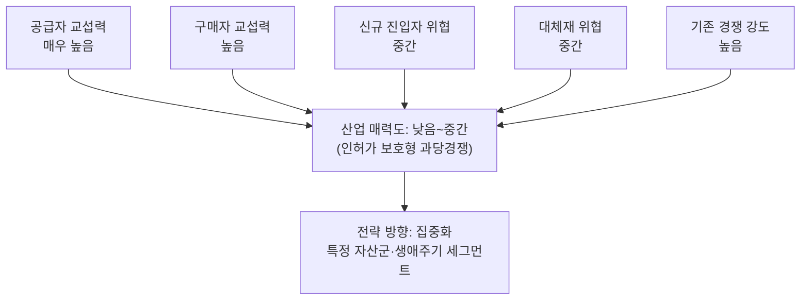

# 분석 ③ — 금융데이터 기반 개인 맞춤형 자산관리 서비스

> [분석 방법론](./porters-five-forces-methodology.md)에 따른 Porter's Five Forces 분석
> 비교 대상: [분석 ④ — 1인 가구 배달·포장 플랫폼](./porters-five-forces-analysis-solo-household-food-delivery.md) · [비교 분석](./porters-five-forces-comparison-asset-management-vs-food-delivery.md)

## 0. 분석 단위 설정

| 항목 | 설정 |
|---|---|
| 분석 주체 | 마이데이터(금융데이터 통합 조회)를 기반으로 개인 자산 현황을 분석하고 맞춤형 자산배분·금융상품을 추천하는 **핀테크 플랫폼 사업자** |
| 수익 모델 | AUM(운용자산) 기반 자문 수수료, 펀드·보험·대출 연계 판매 수수료, 일부 프리미엄 구독 |
| 지역·시점 | 국내 시장, 2026년 현재 (마이데이터 전면 시행 이후) |
| 참고 사례 | 토스(자산관리), 뱅크샐러드, 카카오페이 자산관리 |

⚠️ 여기서 "고객"은 두 층이다. **무료로 조회만 하는 이용자**와 **실제 자산을 맡기거나 상품에 가입하는 유료·AUM 고객**. 게다가 이 산업은 **금융위·금감원이라는 규제당국이 사실상 시장 진입 자체를 결정하는 게이트키퍼**로 작동한다는 점에서 일반 소비재 산업과 다르다.

---

## 1) 공급자의 힘 — **매우 높음**

| 공급자 층 | 힘 | 근거 |
|---|---|---|
| **금융데이터 제공자** (은행·카드사·증권사, 마이데이터 API) | 매우 강함 | API 제공 지연·데이터 품질 저하만으로 서비스 자체가 마비된다. 더 무섭게는 **이들 스스로가 자산관리 서비스를 직접 운영하는 경쟁자**이기도 하다 — 공급자이자 최대 경쟁자라는 이중적 지위. |
| **마이데이터 중계기관** (공공 인프라) | 강함 | 표준 API 규격을 이 기관이 정하고, 규격이 바뀌면 개발 비용이 고스란히 전가된다. |
| **금융권 보안·클라우드 인증** | 중간~강함 | 망분리 등 금융권 특유의 규제로 사용 가능한 클라우드·보안 벤더가 제한적이다. |
| **데이터사이언스·자산배분 알고리즘 인재** | 강함 | 희소 인재라 몸값이 높고, 이탈 시 대체가 어렵다. |

> 📌 **전방 통합의 위협이 이미 현실이다.** 은행·카드사가 마이데이터 기반 자산관리를 자체 앱에서 직접 서비스하고 있어, 공급자가 곧 가장 강력한 경쟁자로 전환되는 구조다.

---

## 2) 구매자의 힘 — **높음**

### 무료 이용자 (마이데이터 조회객)
- 토스·뱅크샐러드·카카오페이를 동시에 설치해 쓰는 멀티호밍이 일반적이고, 전환비용은 사실상 0이다.
- → **매우 강함**

### 유료·AUM 고객 (실제 자산을 맡기는 고객)
- 자산을 맡기는 결정에는 신뢰 축적이 필요해 전환비용이 어느 정도 존재하지만, 로보어드바이저 자문 수수료가 표준화·비교 가능해지며 협상력이 계속 높아지는 추세다.
- → **중간~강함**

---

## 3) 신규 진입자의 위협 — **중간**

| 장벽 요소 | 평가 |
|---|---|
| 규모의 경제 | **중간** — 데이터 처리 인프라는 클라우드로 확보 가능하나, 마이데이터 라이선스 취득 자체에 비용과 시간이 든다. |
| 기술적 우위·특허 | **약함** — 자산배분 알고리즘 자체는 상용화되어 있어 차별화 요소가 되기 어렵다. |
| 채널·브랜드 선점 | **강함** — 금융업 특성상 자산을 맡길 만한 신뢰 브랜드를 쌓는 데 오랜 시간이 걸린다. |

**진짜 장벽은 금융위 마이데이터 라이선스라는 인허가제다.** 정부가 사실상 게이트키퍼 역할을 한다 — 이 점에서 [분석②(수소 전기 승용차)](./porters-five-forces-analysis-hydrogen-passenger-ev.md)의 정책 의존 구조와 유사하다. 다만 라이선스를 통과한 뒤에는 오히려 스타트업(토스, 뱅크샐러드)이 대형 은행보다 UX·추천 경험에서 민첩하게 앞서는 역설적 결과가 나타난다 — **진입장벽은 라이선스 단계에만 존재하고, 그 이후 경쟁은 다시 무방비 상태로 열린다.**

---

## 4) 대체재의 위협 — **중간**

| 충족하려는 욕구 | 대체재 |
|---|---|
| 자산 현황 파악 | 엑셀·수기 가계부, 은행 앱 개별 조회 |
| 투자 자문 | 유튜브 무료 투자 정보, 지인·커뮤니티 조언, 고액자산가 대상 전문 PB 상담 |
| 금융상품 가입 | 은행·증권사 창구에서 중개자 없이 직접 가입 |

가장 치명적인 것은 "그냥 은행 창구에 가서 직접 상담받기"라는 전통적 경로다 — 특히 고액자산가일수록 이 경로를 선호해, 이 플랫폼이 가장 수익성 높은 고객군에서 오히려 대체재 압력을 더 크게 받는 역설이 있다.

---

## 5) 산업 내 경쟁 강도 — **높음**

- 토스·뱅크샐러드·카카오페이 3파전에 은행권 자체 앱까지 가세한다. 무료 마이데이터 조회 기능은 사실상 동일해 차별화가 어렵고, 결국 상품 큐레이션·UX·크로스셀 경쟁으로 수렴한다.
- 무료 조회 기능 유지비용은 크지만 실제 유료 전환율은 낮아, 경쟁이 심해질수록 마진 압박이 구조적으로 커진다.

---

## 종합: 산업 매력도 **낮음~중간** — 인허가 보호형 과당경쟁

라이선스라는 진입장벽이 신규 진입자 전체를 막아주지는 못한다 — 통과한 소수(토스, 뱅크샐러드 등) 안에서는 다시 무방비 경쟁이 펼쳐진다. 즉 이 산업의 매력도는 "누가 라이선스를 갖고 있느냐"가 아니라 "라이선스를 가진 소수끼리 얼마나 치열하게 싸우느냐"로 결정된다.

## 전략 시사점

| 방향 | 내용 |
|---|---|
| **집중화** (권장) | 전 자산군·전 생애주기를 겨냥하지 말고, 특정 세그먼트(예: 사회초년생 소액 투자, 은퇴 설계)에 자문·상품 큐레이션을 집중해 신뢰를 먼저 좁게 쌓는다. |
| **차별화** (조건부 권장) | 추천 알고리즘 자체는 즉시 상향평준화되므로 차별화 요소가 아니다. 대신 UX·신뢰 경험(투명한 수수료 구조, 상담 접근성)이 실질적 차별화 지점이다. |
| **저비용** (비권장) | 금융 컴플라이언스·보안 비용이 구조적으로 높아 원가 우위 확보가 어렵다. |
| *(보조) 크로스셀* | 무료 조회 기능만으로는 수익화가 안 되므로, 조회 데이터를 상품 판매(펀드·보험·대출)로 연결하는 크로스셀이 사실상 주 수익원이다. |
