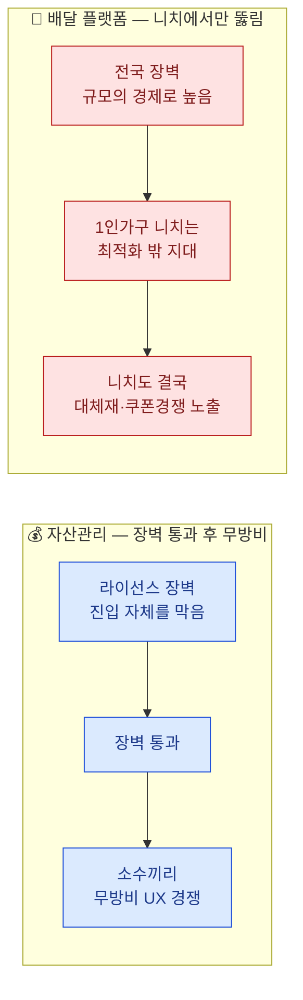

# 비교 분석 — 개인 맞춤형 자산관리 vs. 1인 가구 배달·포장 플랫폼

> 개별 분석: [분석 ③ — 자산관리](./porters-five-forces-analysis-personal-asset-management.md) · [분석 ④ — 배달 플랫폼](./porters-five-forces-analysis-solo-household-food-delivery.md)
> [분석 방법론](./porters-five-forces-methodology.md)

## 1. 힘의 세기 비교

| 힘 | 자산관리 서비스 | 배달·포장 플랫폼 |
|---|---|---|
| 공급자 | 매우 높음 (금융데이터 제공자가 곧 경쟁자) | 중간~강함 (라이더 멀티호밍) |
| 구매자 | 높음 (무료층 매우 강함 + 유료층 강화 추세) | 매우 높음 (소비자·입점업체 모두 멀티호밍) |
| 신규 진입자의 위협 | 중간 (라이선스 장벽, 통과 후엔 무방비) | 낮음, 단 니치는 예외 |
| 대체재의 위협 | 중간 (은행 창구 직접 상담이라는 전통 경로) | 매우 높음 (HMR 품질 급상승) |
| 기존 경쟁 강도 | 높음 (무료 기능 동질화 → 상품·UX 경쟁) | 매우 높음 (쿠폰 + 라이더 배달비 이중 압박) |
| **산업 매력도** | **낮음~중간 — 인허가 보호형 과당경쟁** | **낮음 — 이중 비용압박형 과밀** |

## 2. 구조적 차이이자 공통점: "장벽의 국지적 무력화"

두 산업은 표면적으로 반대처럼 보이지만 같은 패턴을 공유한다. **진입장벽이 산업 전체를 균일하게 막지 않고, 특정 지점에서 무력화된다.** 자산관리는 라이선스라는 관문을 통과한 "이후"에 장벽이 사라지고, 배달 플랫폼은 대형 사업자가 최적화하지 않은 "니치 세그먼트"에서 장벽이 사라진다. 다만 무력화되는 방식은 정반대다 — 자산관리는 시간(진입 이후 단계)이 조건이고, 배달은 공간·세그먼트(니치 지점)가 조건이다.

## 3. 공통점: 구매자 멀티호밍이 두 산업 모두의 수익성을 깎는다

- 자산관리의 무료 이용자와 배달의 소비자·입점업체는 모두 **복수 플랫폼을 동시에 쓰는 것이 표준 행동**이다. 이는 두 산업 모두에서 구매자 힘을 구조적으로 높이는 공통 원인이다.
- 두 산업 모두 **핵심 공급자가 동시에 경쟁자이거나 준경쟁자**다 — 자산관리는 금융데이터 제공자(은행)가 자체 서비스를 운영하고, 배달은 라이더가 멀티호밍하며 사실상 플랫폼 간 자원을 실시간으로 재배분한다.
- 두 산업 모두 **대체재가 "그냥 원래 하던 방식으로 돌아가는 것"**이라는 공통점이 있다 — 자산관리는 은행 창구 직접 상담, 배달은 집에서 직접 조리(HMR)다. 신기술 기반 서비스일수록 가장 무서운 경쟁자는 신기술이 아니라 전통적 방식일 수 있다.

## 4. 전략적 시사점 비교

| | 자산관리 서비스 | 배달·포장 플랫폼 |
|---|---|---|
| **1순위 전략** | 집중화 — 전 생애주기 대신 특정 세그먼트(사회초년생, 은퇴설계)에 신뢰를 좁게 쌓기 | 집중화 — 전국 반경 대신 1인 가구 밀집 지역의 소용량·근거리 니치 |
| **차별화 가능 지점** | 알고리즘이 아니라 수수료 투명성·상담 접근성 같은 신뢰 경험 | 거의 없음 — 메뉴·UI 차별화는 즉시 복제됨 |
| **저비용 가능성** | 낮음 — 금융 컴플라이언스 비용이 구조적으로 큼 | 낮음 — 쿠폰 경쟁과 라이더 배달비가 동시에 원가를 끌어올림 |
| **구조 전환 레버** | 무료 조회를 상품 판매로 연결하는 크로스셀이 사실상 유일한 수익원 | 구독형 정기주문으로 수요를 예측 가능하게 만들어 라이더 효율을 개선하는 것이 원가 압박을 완화하는 유일한 레버 |
