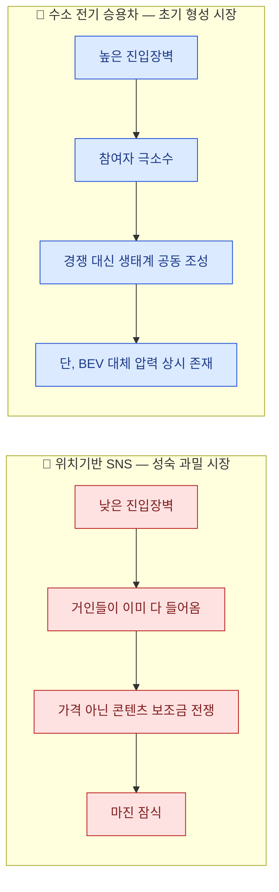

# 비교 분석 — 위치기반 SNS vs. 수소 배터리 전기 승용차

> 개별 분석: [분석 ① — 위치기반 SNS](./porters-five-forces-analysis-location-sns.md) · [분석 ② — 수소 전기 승용차](./porters-five-forces-analysis-hydrogen-passenger-ev.md)
> [분석 방법론](./porters-five-forces-methodology.md)

## 1. 힘의 세기 비교

| 힘 | 위치기반 SNS | 수소 전기 승용차 |
|---|---|---|
| 공급자 | 높음 (OS 게이트키퍼·지도 API·클라우드·크리에이터 4중 의존) | 매우 높음 (희소금속·연료전지 스택·충전 인프라 사업자) |
| 구매자 | 높음 (광고주 매우 강함 + 사용자 강함) | 높음, 결이 다름 (개인 소비자 매우 강함 + 정부는 구매자이자 규제자) |
| 신규 진입자의 위협 | 높음 (전통 장벽은 약하나 로컬 네트워크 효과가 방어자에게 불리) | 낮음 (규모의 경제·특허·채널 3요소 모두 강한 장벽) |
| 대체재의 위협 | 매우 높음 (가처분 시간을 다투는 모든 콘텐츠) | 매우 높음 (BEV가 동일 욕구를 표준에 가깝게 충족) |
| 기존 경쟁 강도 | 매우 높음 (3강 구도, 콘텐츠 보조금·기능 복제로 경쟁) | 낮음 (참여자 극소수, 경쟁보다 생태계 공동 조성 단계) |
| **산업 매력도** | **낮음 — 과밀형** | **중간(조건부) — 초기 고정형** |

## 2. 구조적 차이: 두 산업은 산업 생애주기의 정반대 지점에 있다

- **위치기반 SNS**는 진입장벽이 낮아 누구나 로컬 교두보를 만들 수 있지만, 그 낮은 장벽을 거인들도 똑같이 이용해 기능을 복제해 온다. 경쟁은 가격이 아니라 크리에이터 펀드·알고리즘 투자 같은 **비용 상승형** 소모전으로 나타난다.
- **수소 전기 승용차**는 규모의 경제·특허·채널이 모두 진입을 막아 참여자가 극소수지만, 그 대신 차량·충전소·정비망을 동시에 갖춰야 하는 **생태계 전체 장벽** 때문에 혼자서는 진입 자체가 성립하지 않는다.
- 결과적으로 SNS는 "누구나 들어올 수 있어서 못 버는" 구조, 수소차는 "아무도 못 들어와서 아직 시장이 작은" 구조다 — 매력도의 원인이 정반대다.

## 3. 공통점: 대체재가 두 산업 모두의 최대 리스크

- SNS의 대체재는 특정 경쟁사가 아니라 **가처분 시간을 다투는 모든 콘텐츠 산업**이고, 수소차의 대체재는 **BEV라는 단일하지만 압도적인 대안**이다. 형태는 다르지만 두 산업 모두 "산업 내부의 힘 관계를 아무리 잘 관리해도 산업 경계 밖의 대안이 수익성의 상한을 정한다"는 점은 동일하다.
- 두 산업 모두 **핵심 공급자에 대한 협상력이 구조적으로 약하다** — SNS는 OS 게이트키퍼·지도 API, 수소차는 희소금속·충전 인프라 사업자. 다만 SNS의 의존은 계약·기술로 일부 완화 가능한 반면, 수소차의 의존(지리적으로 편중된 희소금속)은 완화 여지가 훨씬 작다.

## 4. 전략적 시사점 비교

| | 위치기반 SNS | 수소 전기 승용차 |
|---|---|---|
| **1순위 전략** | 집중화 — 전국 정면 승부 대신 로컬 밀도 우선 확보 | 집중화 — 개인 승용차 대신 상용·플릿 세그먼트 우선 |
| **차별화의 함정** | 기능 차별화는 거인에게 즉시 복제됨 (릴스가 틱톡을 흡수한 사례) | 기술 차별화(충전시간·주행거리)는 유효하나 BEV 발전 속도에 유효기간이 걸림 |
| **저비용 가능성** | 낮음 — 클라우드·지도 API 공급자 협상력이 강함 | 거의 없음 — 희소금속 의존으로 원가 우위 자체가 성립하기 어려움 |
| **구조 전환 레버** | 광고에서 커머스·예약 전환으로 수익원을 옮기면 구매자 구조 자체가 바뀜 | 완성차 단독이 아니라 에너지 기업·정부와의 생태계 파트너십이 진입의 전제조건 |
