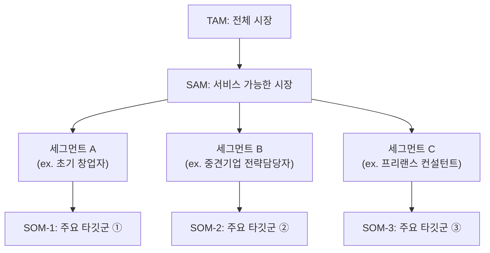
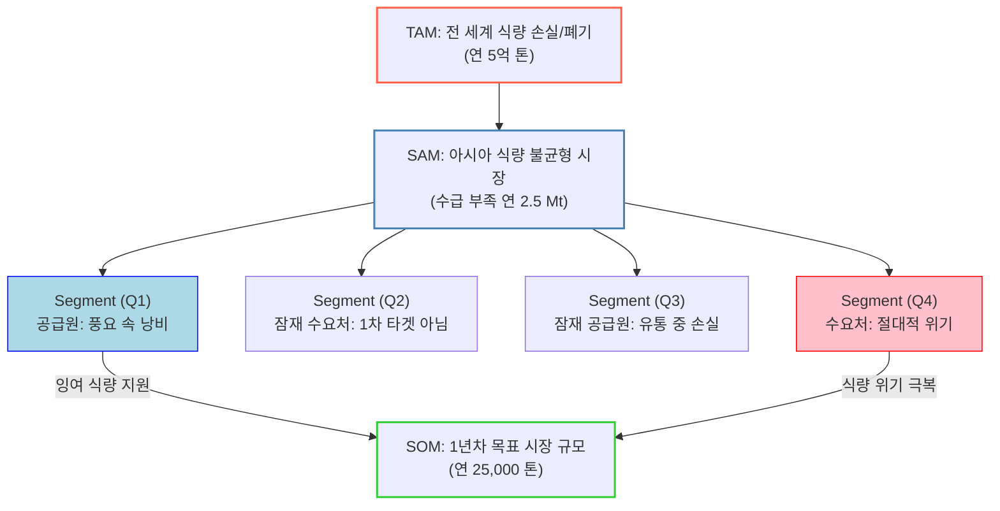

# 04 - TAM-SAM-SOM 과 Market Segment Map: 7단계 AI 활용 리서치 전략

> 출처: 사용자 첨부 docx 4건(1~4단계 리서치보고서, 5단계 정량적검증및시각화, 6단계 반복적정제 최종산출물, 7단계 솔루션구체화 SRS) + 강의 자료 원본(`ExportBlock-*.zip` Notion export) + [ChatGPT 채팅 기록](https://chatgpt.com/share/6a757729-0df4-83ee-b865-fbd893546cb7)(자동 인출 실패 — 페이지 용량 초과로 텍스트를 가져오지 못함. docx 산출물이 그 대화의 결과물이므로 내용은 docx로 충분히 재구성 가능).
> 이 시장 연구는 앞선 [Porter's Five Forces](../../porters-five-forces/porters-five-forces-analysis-solo-household-food-delivery.md) · [가치사슬](../../value-chain/value-chain-analysis-solo-household-food-delivery.md) · [TAM 딥리서치](../tam-research-solo-household-food-delivery.md) 분석을 이어받아, "1인 가구 대상 음식 배달·포장 주문 플랫폼"을 더 근본적인 문제(1인 가구의 한 끼 해결)로 재정의하며 심화한 것이다.

## 시장 규모 분석의 세 가지 층위: TAM-SAM-SOM

> TAM, SAM, SOM : "시장 크기를 정량적으로 파악하는 계층적 도식"

| 구분 | 의미 | "SaaS 온라인 비즈니스 컨설팅 시장" 사례의 시장 Breakdown 예시 | 시장 규모 산정을 위한 주요 데이터 출처 |
| --- | --- | --- | --- |
| **TAM (Total Addressable Market)** | 전체 시장 규모 — "이론적으로 접근 가능한 전체 수요" | 글로벌 SaaS 비즈니스 컨설팅 시장 | Statista, IBISWorld, Crunchbase |
| **SAM (Serviceable Available Market)** | 실제로 서비스 가능한 시장 — "우리 제품/서비스가 현실적으로 도달 가능한 영역" | 한국 내 스타트업 컨설팅 SaaS 시장 | K-Startup, 중소기업청, AI Hub |
| **SOM (Serviceable Obtainable Market)** | 단기적으로 점유 가능한 시장 — "현재 리소스로 실현 가능한 목표 범위" | 초기 타깃 3개 산업군(교육, 프리랜스, 리테일) | 설문·JTBD 인터뷰, 검색 트렌드 |

## Market Segment Map

> 시장을 단순 수치로 나누는 게 아니라, '행동 단서'와 '구매 맥락' 중심으로 시각화하는 지도.

### TAM-SAM-SOM 과 시장 세그먼트의 관계 구조 (일반형)



> AI 리서치에서는 문제의식만 확실하다면 그에 따른 솔루션 가설 검토에 집중할 수 있다. 사람이 직접 특정 수치 계산에 매몰되어 계속 계산해가는 피곤한 방식으로 아이디어를 다듬을 필요가 없다 — 실시간으로 AI에게 "정성&정량 데이터 확인 · 글로벌&로컬 시장의 맥락 고려 · 다층적 사용자들의 행동에 대한 교차분석"을 수행시키며 토론할 수 있기 때문이다.

## 7단계 AI 활용 리서치 전략표

| 전략 단계 이름 | 사용자 행동 | AI 활용 방식 | AI 역할 / 산출물 |
| --- | --- | --- | --- |
| 1. 광범위한 탐색 (Broad Inquiry) | 거시적이고 복합적인 문제(시장)를 정의 (예: "세계 식품 폐기 규모와 원인") | `데이터 탐색` + `Deep Research` (정성적/정량적 데이터를 동시에 요청) | 초기 정보 제공 및 광범위한 데이터 수집 |
| 2. 범위 축소 (Funneling) | AI의 질문을 통해 연구 범위를 구체적으로 좁히기 (예: "곡물/과일, 아시아, 5년, 절대량") | `논리 정제 및 검토` (연구 설계를 보조하며 초점을 명확화) | 제약 조건(식품군, 지역, 기간, 지표)을 역으로 질문하여 연구 범위를 한정 |
| 3. 핵심 원인 분석 (Causal Analysis) | 1차 데이터에서 더 근본적인 문제(기아)로 초점 이동(Pivoting) | `데이터 탐색` + `Deep Research` (연관된 더 깊은 문제로 리서치 심화) | 심층 분석 자료 제공 |
| 4. 가설 수립 (Hypothesis Formation) | 핵심 원인('구조적 빈곤')을 기반으로 가설을 설정하고 검증을 요청 | `논리 정제 및 검토` (가설 검증을 위한 스파링 파트너로 활용) | 가설을 확인(Validate)하고 뒷받침 논거 및 데이터 제공 |
| 5. 정량적 검증 (Quantitative Validation) | 가설 입증을 위해 상반되는 데이터의 시각화 요청 | `Deep Research` + `시각화 및 분석(Canvas)` | 요청 데이터를 비교하는 맞춤형 차트 생성(1차 초안) |
| 6. 반복적 정제 (Iterative Refinement) | 1차 차트를 검토하고 더 세분화된 수정/보완을 지시 | `시각화 및 분석(Canvas)` + `논리 정제` | 피드백을 즉각 반영한 최종 시각화 자료 및 데이터 테이블 |
| 7. 솔루션 구체화 (Solution Definition) | 검증된 데이터를 바탕으로 구체적 솔루션 실행을 계획 | `브레인스토밍` + `Deep Research` | 아이디어를 구체적인 실행 계획(SRS)으로 문서화 |

## "문제의식 to 솔루션 7단계 전략"으로부터 TAM-SAM-SOM 과 Market Segment Map 이 추출되는 단계별 대응구조

> 문제의식 중심으로 워크플로우를 수행하면 TAM-SAM-SOM과 Market Segment Map이 별도 작업이 아니라 7단계 진행 과정에서 자연스럽게 도출된다. 아래는 강의 예시(글로벌 식량 손실 재분배 플랫폼)의 매핑이며, 우리 프로젝트(1인가구 한 끼 해결)에 이 구조를 그대로 적용한 결과는 [08-tam-sam-som-mapping.md](./08-tam-sam-som-mapping.md)에 별도 정리했다.



### TAM-SAM-SOM은 어느 단계에서 나오는가? (강의 예시)

| 구분 | 작업 단계 대응 | 시장 정의 | 시장 규모(대화 데이터 기반 추정) | 근거 |
| --- | --- | --- | --- | --- |
| TAM(전체 시장) | 1단계(광범위한 탐색) | 전 세계 식량 손실 및 폐기 규모(기부금으로 재분배 가능한 잠재적 공급원) | 연간 약 5억 톤 | "글로벌 식품 손실·폐기 ≈ 5억 t/년, 생산량의 30-40%" |
| SAM(유효 시장) | 2단계(범위 축소) | 플랫폼 초기 집중 영역(아시아)의 곡물/과일 수급 부족 규모(수요처) | 연간 약 2.5 Mt(250만 톤) | 아시아권 5년간 총 부족량(-12.5 Mt)을 연평균 환산 |
| SOM(초기 점유 시장) | 7단계(솔루션 구체화) | 플랫폼 1년 차(MVP)에 물류비 기금을 모아 연결 가능한 곡물 규모(SAM의 1%) | 연간 25,000톤(0.025 Mt) | 7단계 논의에서 도출된 "SAM의 1%" MVP 1년 차 목표치 |

## Market Segment Map 시각화하기

> 매트릭스, 좌표평면, 벤다이어그램, 히트맵 등 다양한 방식 중 **"내 비즈니스 아이디어에 가장 적절한 형태"**를 적용한다.

```jsx
"마켓 세그먼트를 이해하기 가장 쉽도록 표현할 수 있는 적절한 시각화 방향(매트릭스, 좌표평면, 밴다이어그램, 히스토그램, 히트맵 등 모든 방법 고려)을 찾아서 Mermaid 차트로 표현해줘"
```

### 강의 예시: 2×2 매트릭스 (X축: 식량 잉여/부족, Y축: 물류·인프라 접근성)

| | **잉여 (Surplus)** (Source: 공급원) | **부족 (Shortage)** (Target: 수요처) |
| --- | --- | --- |
| **양호 (Good Access)** | **Q1: "풍요 속 낭비" (핵심 공급원)** — 물류 인프라는 갖췄으나 가격방어·규격미달로 과잉폐기 발생(북미 옥수수, 유럽 시장철수). 전략: 핵심 공급원, 물류비만 확보되면 즉시 대규모 식량 확보 가능. | **Q2: "풍요 속 빈곤" (구조적 빈곤)** — 시장/인프라는 있으나 소득·가격 격차로 식량을 살 수 없는 인구(28억 명). 전략: 1차 타겟 아님(현금·바우처 지원이 더 효과적). |
| **취약 (Poor Access)** | **Q3: "유통 중 손실" (잠재 공급원)** — 생산은 성공했으나 열악한 인프라(도로·콜드체인)로 수확 후 손실(아시아·아프리카 20-40%). 전략: 잠재적 공급원(물류비 외 인프라 개선비 추가 고려). | **Q4: "절대적 위기" (핵심 타겟)** — 분쟁·재해로 생산·물류가 동시 붕괴(아프리카 가뭄, 파키스탄 홍수, 수단/가자 분쟁). 전략: 핵심 목표 시장, Q1·Q3의 식량을 이곳으로 연결하는 물류비 모금. |

> 우리 프로젝트(1인가구 한 끼 해결)에 맞는 2×2 매트릭스는 [09-market-segment-map.md](./09-market-segment-map.md)에서 별도로 설계했다 — 같은 형식을 그대로 베끼지 않고, "예산 민감도 × 시간 민감도"라는 우리 프로젝트 고유의 두 축을 사용한다.

### 소비특성 사례에서 특히 많이 나오는 대안 포맷

컨설팅형·소비자행동형 주제에서는 아래와 같은 축 조합도 자주 쓰인다 (참고용 빈 틀):

| | 적극 | 소극 |
| --- | --- | --- |
| **높음** (기존 지식 보유 수준) | | |
| **낮음** (기존 지식 보유 수준) | | |

X축: 정보 탐색 성실성 / Y축: 기존 지식 보유 수준.

## 이 폴더의 구성

| 파일 | 대응 단계 | 핵심 산출물 |
| --- | --- | --- |
| [00-overview.md](./00-overview.md) | — | 최종 가설, 프로젝트 전체 요약, 로직 흐름도 |
| [01-broad-inquiry.md](./01-broad-inquiry.md) | 1. 광범위한 탐색 | 시장 정의, 최신 시장규모, 수요/공급/경쟁/대체재 지도, 문제 후보 목록 |
| [02-funneling.md](./02-funneling.md) | 2. 범위 축소 | 타깃·지역·상황·채널·핵심지표 정의, TAM/참고 SAM, 제외 범위 |
| [03-causal-analysis.md](./03-causal-analysis.md) | 3. 핵심 원인 분석 | 원인-니즈-시장마찰 인과사슬, 근본원인/증상 구분, 데이터 근거 |
| [04-hypothesis-formation.md](./04-hypothesis-formation.md) | 4. 가설 수립 | 대안가설 비교, 경쟁사 반증, 폐기/피벗 기록, 최종 가설과 5단계 측정변수 |
| [05-quantitative-validation.md](./05-quantitative-validation.md) | 5. 정량적 검증 | 정량 검증 차트·테이블 (원본 docx 확보 완료) |
| [06-iterative-refinement.md](./06-iterative-refinement.md) | 6. 반복적 정제 | 최종 시각화 자료 및 데이터 테이블 |
| [07-solution-definition-srs.md](./07-solution-definition-srs.md) | 7. 솔루션 구체화 | 실행계획 + SRS(소프트웨어 요구사항 명세서) |
| [08-tam-sam-som-mapping.md](./08-tam-sam-som-mapping.md) | 종합 | 우리 프로젝트의 TAM/SAM/SOM 단계별 대응구조 |
| [09-market-segment-map.md](./09-market-segment-map.md) | 종합 | 우리 프로젝트의 Market Segment Map (2×2 매트릭스) |
