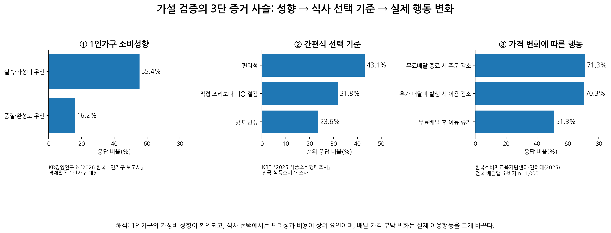
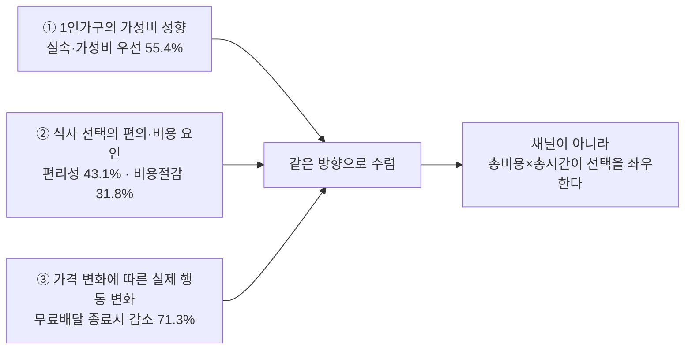

# 6단계 — 반복적 정제 (Iterative Refinement)

> 1인가구의 한 끼 해결 가설 검증 결과 정제 및 최종 시각화.
> **정제 목표**: [5단계](./05-quantitative-validation.md)에서 만든 여러 그래프 중 가설을 직접 검증하지 못하거나 표본·인과 해석이 약한 자료는 제거하고, 서로 보완되는 핵심 데이터만 하나의 증거 사슬로 수렴시킨다.
> **AI 역할**: 데이터 정제 및 시각화 담당
> **핵심 산출물**: 최종 시각화 자료 및 데이터 테이블

## 1. 1차 시각화 검토 결과

| 1차 자료 | 판정 | 판정 이유 | 최종 처리 |
| --- | --- | --- | --- |
| 1인가구 10년 증가 추이 | 이동 | 시장 배경에는 유용하지만 「편리함+합리적 비용」 가설을 직접 검증하지 않음 | 1~2단계 시장 배경/부록으로 이동 |
| KB 1인가구 가성비 55.4% | 유지 | 1인가구 자체를 대상으로 한 최신 자료이며 소비 성향을 직접 보여줌 | 최종 시각화의 1단 증거 |
| KREI 편리성 43.1%·비용절감 31.8% | 유지 | 식사/간편식 선택에서 편의성과 비용이 실제 상위 요인임을 보여줌 | 최종 시각화의 2단 증거 |
| 무료배달 종료 71.3%·추가 배달비 70.3% | 유지 | 가격 조건이 태도 수준을 넘어 실제 이용 행동을 바꾸는지 직접 확인 | 최종 시각화의 3단 증거 |
| 배민 42.1%×59.7%=25.1% 환산 | 제외 | 표본 수 미공개이며 25.1%는 2개 비율을 곱한 파생치 | 메인 차트 제외, 필요 시 각주만 |
| 배민 한그릇 10배·11배·13배 | 강등 | 서비스 지역·메뉴 확대가 동시에 발생해 순수 가격효과로 볼 수 없음 | 보조 사례로만 활용 |

## 2. 논리 정제: 가설을 데이터가 실제로 말할 수 있는 수준으로 수정

**정제 전**: "1인 가구는 혼자 한 끼를 해결할 때 편리함과 합리적인 비용을 함께 중요하게 여기며, 가격 부담이 커질 경우 실제 식사·배달 선택을 변경한다."

**정제 후**: "1인가구는 전반적으로 가성비를 중시하는 성향이 뚜렷하며, 식품 소비에서는 편리성과 비용이 핵심 선택 요인으로 나타난다. 또한 배달시장에서는 가격 부담의 증감이 이용 빈도 변화와 강하게 연결된다."

**이렇게 바꾼 이유**: KB는 1인가구 표본, KREI와 배달앱 조사는 전체 식품소비자·배달앱 이용자 표본이다. 따라서 세 자료를 한 표본처럼 합쳐 "1인가구에서 정확히 70%가 행동을 바꾼다"고 단정하지 않고, 서로 다른 자료가 같은 메커니즘을 지지하는 **'증거 사슬'**로 해석한다.

## 3. 최종 통합 시각화

**핵심 메시지**: "싸고 편해야 한다"는 니즈는 하나의 설문에서 우연히 나온 숫자가 아니다. ① 1인가구 자체의 소비 성향, ② 식품 선택 요인, ③ 배달 가격 변화에 따른 행동이라는 서로 다른 자료가 같은 방향으로 수렴한다.

## 4. 최종 데이터 테이블

| 증거층 | 핵심 지표 | 수치 | 비교/맥락 | 연도 | 출처 | 해석 한계 |
| --- | --- | --- | --- | --- | --- | --- |
| 1인가구 소비성향 | 실속·가성비 우선 | 55.4% | 품질·완성도 우선 16.2% | 2026 | KB경영연구소 「2026 한국 1인가구 보고서」 | 1인가구 직접 표본. 다만 식사만이 아닌 전반적 소비 성향 |
| 간편식 선택 요인 | 편리성 | 43.1% | 비용 절감 31.8%, 맛·다양성 23.6% | 2025 | KREI 「2025 식품소비행태조사」 | 식품·식사 맥락 직접 자료. 1인가구 전용 표본은 아님 |
| 간편식 선택 요인 | 직접 조리보다 비용 절감 | 31.8% | 편리성과 함께 상위 2대 요인 | 2025 | KREI 「2025 식품소비행태조사」 | 비용 효율이 실제 구매 이유임을 확인 |
| 배달 행동 변화 | 무료배달 종료 시 주문 감소 | 71.3% | 무료배달 후 이용 증가 51.3% | 2025 | 한국소비자교육지원센터·인하대 | 전국 배달앱 소비자 n=1,000 |
| 배달 행동 변화 | 추가 배달비 발생 시 이용 감소 | 70.3% | 가격 부담이 이용결정에 직접 영향 | 2025 | 한국소비자교육지원센터·인하대 | 정책 가정 문항. 실제 결제 로그는 아님 |

## 5. 6단계 최종 결론

- 최종적으로 메인 시각화는 3개의 증거층만 남긴다: ① 1인가구의 가성비 성향, ② 식사 선택에서 편리성·비용 요인, ③ 가격 변화에 따른 배달 행동.
- 1인가구 규모 추이, 배민 내부조사 환산치, 한그릇 증가배수는 가설의 직접 검증력이 상대적으로 약하거나 인과 해석 한계가 있어 메인 차트에서 제거한다.
- 따라서 최종 메시지는 **"1인가구의 가성비 성향과 식사 시장의 편의·비용 선택 요인이 일치하며, 가격 부담 변화는 실제 배달 이용 행동과 강하게 연결된다"**로 수렴시킨다.

## 6. 출처

- KB경영연구소. 2026 한국 1인가구 보고서, 2026-07-19. https://www.kbfg.com/kbresearch/report/reportView.do?reportId=2000498
- 한국농촌경제연구원(KREI). 2025년 식품소비행태조사 결과발표대회, 2025-12-12. https://www.krei.re.kr/krei/page/24?cmd=view&pageIndex=1&pst=504427
- 한국소비자교육지원센터·인하대학교. 배달앱 이용행태와 소비자만족도 조사, 2025년 8월 조사. https://koince.or.kr/bbs/board.php?bo_table=sub4_2&wr_id=9
