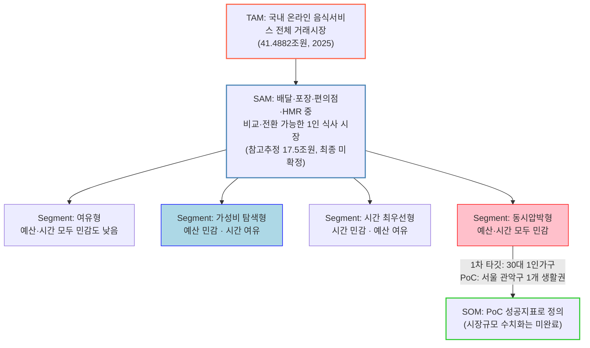

# 단계별 대응구조 — 우리 프로젝트의 TAM-SAM-SOM

> ["문제의식 to 솔루션 7단계 전략"으로부터 TAM-SAM-SOM이 추출되는 단계별 대응구조](./00-methodology.md#문제의식-to-솔루션-7단계-전략으로부터-tam-sam-som-과-market-segment-map-이-추출되는-단계별-대응구조)를 1인 가구 한 끼 해결 프로젝트에 적용한 결과.

## 관계도

## TAM-SAM-SOM은 어느 단계에서 나왔는가

| 구분 | 작업 단계 대응 | 시장 정의 | 시장 규모 | 근거 |
| --- | --- | --- | --- | --- |
| **TAM** (전체 시장) | **1~2단계** ([광범위한 탐색](./01-broad-inquiry.md) → [범위 축소](./02-funneling.md)) | 국내 온라인 음식서비스 전체 거래시장 | **41.4882조원 (2025)** | 국가데이터처 「2025년 12월 온라인쇼핑동향」 — 공식 통계, 확정치 |
| **SAM** (유효 시장) | **2단계**([범위 축소](./02-funneling.md)) 산출, **5단계**([정량 검증](./05-quantitative-validation.md)) 이후에도 미확정 | 배달·포장·편의점·HMR 중 비교·전환 가능한 1인 식사 시장 | **참고 추정 약 17.5조원** (41.4882조 × 배민 1인 주문자 비중 42.1%) — **최종 확정 아님** | 2단계 문서: "채널 간 중복과 이용빈도 데이터가 필요. 5단계 이후 재산정" — 그러나 5단계는 시장규모가 아니라 가설(편의성+비용 니즈)의 사실 여부만 검증했고, 채널별 중복 제거 데이터는 여전히 확보되지 않음 |
| **SOM** (초기 점유 시장) | **7단계**([솔루션 구체화](./07-solution-definition-srs.md)) | 1차 타깃(30대 1인가구, 서울 관악구 PoC) 대상 초기 서비스 | **원화/건수로 수치화되지 않음** — 대신 PoC 성공지표(결정시간 30%↓, 선택비용 10%↓, 추천수용률 40%↑)로 대체 정의 | 7단계 SRS 6.1절 "PoC 핵심 지표와 성공 기준" |

## 강의 예시(식량 손실)와의 핵심 차이 — 정직하게 짚어야 할 갭

이 프로젝트는 강의 예시와 달리 **SAM과 SOM이 최종적으로 숫자 하나로 닫히지 않았다.** 이유는 두 가지다.

1. **최종 가설이 다채널 통합형이다.** 식량 손실 예시는 "곡물/과일 × 아시아 × 수급부족량"처럼 단일 축으로 SAM을 정의할 수 있었지만, 이 프로젝트의 최종 가설(4단계)은 "배달·포장·편의점·HMR 중 상황에 따라 전환한다"는 **채널 간 이동**을 다루므로, 채널별 이용빈도와 중복 이용자를 제거하지 않으면 SAM을 하나의 숫자로 합칠 수 없다.
2. **MVP에 수익모델이 아직 없다.** 7단계 SRS는 "한끼라우터"를 "주문 중개 X, 의사결정 지원에 집중"으로 명확히 정의했지만, 수수료·구독·광고 등 **화폐화 방식은 정의하지 않았다.** 수익모델이 없으면 SOM을 "매출 규모"로 환산할 근거 자체가 없다 — PoC 지표(결정시간·선택비용 단축)로 대체한 것은 임기응변이 아니라, 이 단계에서 정직하게 낼 수 있는 유일한 수치라는 뜻이다.

## 다음 리서치로 남는 과제

- **SAM 재산정**: 배달·포장·편의점·HMR 각 채널의 1인 가구 이용빈도·중복 이용률 데이터를 확보해 채널 간 중복을 제거한 실사업 SAM을 다시 계산해야 한다.
- **수익모델 정의 후 SOM 수치화**: 한끼라우터가 수수료(제휴처 전환당 과금)·구독·광고 중 무엇으로 화폐화할지 정한 뒤, "1차 타깃(30대 1인가구 144.3만 가구) × 전환율 × 객단가"의 bottom-up 계산으로 SOM을 금액으로 환산할 수 있다. 이 계산에 필요한 전환율·객단가는 현재 PoC(관악구 1개 생활권) 결과가 나온 뒤에야 근거를 가질 수 있다 — 지금 임의로 숫자를 넣는 것은 가짜 정밀도(false precision)이므로 보류한다.
