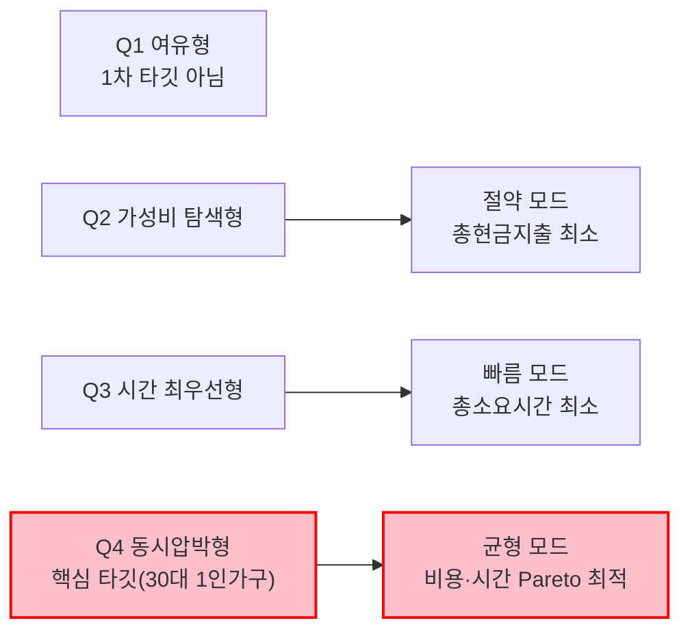

# Market Segment Map — 1인 가구 한 끼 해결

> [Market Segment Map 시각화 지침](./00-methodology.md#market-segment-map-시각화하기)에 따라, 강의 예시(잉여/부족 × 인프라 접근성)를 그대로 베끼지 않고 **이 프로젝트의 최종 가설이 실제로 다루는 두 변수**를 축으로 잡았다. [4단계](./04-hypothesis-formation.md)에서 정의한 5단계 핵심 변수(총비용, 총소요시간)와 [7단계 SRS](./07-solution-definition-srs.md)의 추천 3모드(절약/빠름/균형)가 이 매트릭스의 네 칸에 그대로 대응한다.

## 왜 이 두 축인가

- 후보로 검토했던 축: (a) 연령대 × 배달 결제액 — 이미 7단계 SRS의 스캐터에서 사용함(중복), (b) 채널 선호(배달/포장/HMR) × 가격 — 채널은 결과 변수이지 세그먼트를 나누는 원인 변수가 아님.
- 최종 채택: **예산 민감도 × 시간 민감도.** 이 프로젝트의 최종 가설 자체가 "채널이 아니라 총비용×총시간이 선택을 좌우한다"이므로, 세그먼트도 이 두 변수로 나누는 것이 가설-세그먼트-솔루션(3모드)을 하나의 논리로 꿰는 가장 직접적인 방법이다.

## 2×2 매트릭스

| | **예산 민감도 낮음** | **예산 민감도 높음** |
| --- | --- | --- |
| **시간 민감도 낮음** | **Q1: 여유형** 특징: 배달·외식을 채널 고민 없이 이용. 가격도 시간도 크게 신경 쓰지 않음. 근거: [5단계](./05-quantitative-validation.md)의 "실속·가성비 우선 55.4%" 이면에 있는 나머지 44.6% 중 일부. 전략: **1차 타깃 아님.** 이미 만족도가 높아 서비스 개입 유인이 약함. | **Q2: 가성비 탐색형** 특징: 시간 여유는 있어 포장·편의점·HMR 등을 직접 비교할 수 있음. 최저가 탐색에 적극적. 근거: KREI "간편식 비구매 이유 1위 가격이 비싸서 37.9%"([3단계](./03-causal-analysis.md)) — 가격에 극도로 민감한 층. 전략: **"절약" 모드 핵심 유저.** 정보 탐색 자체를 대신해주는 것이 가치 제안. |
| **시간 민감도 높음** | **Q3: 시간 최우선형** 특징: 돈보다 지금 당장의 시간이 아까움. 배달을 압도적으로 선호. 근거: 배민 "혼자 먹을 음식 주문 42.1%"·최소주문금액 완화 후 주문 급증([3단계](./03-causal-analysis.md)) — 편의성이 곧 시간 절약. 전략: **"빠름" 모드 핵심 유저.** 비교할 시간조차 아까우므로 즉시 추천이 핵심. | **Q4: 동시압박형 (핵심 타겟)** 특징: 예산도 시간도 여유가 없어 매번 트레이드오프에 시달림. "평일 퇴근 후 혼자 한 끼"의 전형. 근거: [7단계](./07-solution-definition-srs.md) 1차 타깃 30대 1인가구(144.3만 가구, 월평균 결제액 101,491원로 전 연령대 최고)와 정확히 일치. 전략: **핵심 목표 시장 · "균형" 모드.** 한끼라우터의 존재 이유 자체가 이 사분면. |

## 세그먼트 → 솔루션 대응

## 이 매트릭스가 말해주는 것

- 강의 예시(식량 손실)의 매트릭스는 "공급원 vs 수요처"를 물리적으로 연결하는 물류 문제였지만, 이 매트릭스는 **한 사람이 상황에 따라 네 칸을 오간다**는 점이 다르다 — 같은 30대 1인가구도 월급날 직후엔 Q1(여유형), 월말엔 Q4(동시압박형)로 이동할 수 있다. 즉 세그먼트는 "사람 유형"이 아니라 **"상황(occasion) 유형"**에 가깝다.
- 이는 [00-overview.md](./00-overview.md)의 최종 가설("채널이 아니라 총비용×총시간이 선택을 좌우한다")과 정합적이다 — 애초에 고정된 사람 세그먼트를 나누는 것 자체가 최종 가설과 살짝 어긋나므로, PoC(6-1절 지표)에서는 "같은 사용자가 어떤 조건일 때 어느 사분면으로 이동하는지"를 함께 관찰할 필요가 있다는 것이 이 시각화의 실질적 시사점이다.
