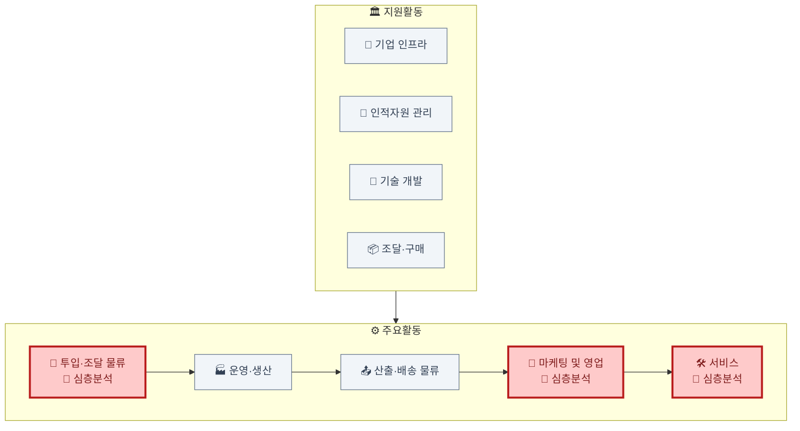

# 가치사슬 분석: 위치기반 이미지·숏폼 영상 SNS

> 분석 대상: 사용자의 현재 위치를 중심으로 이미지·숏폼 영상을 노출·공유하는 SNS 서비스(가칭 대표 사업자 기준). [Porter's Five Forces 비교](../porters-five-forces/porters-five-forces-comparison-location-sns-vs-hydrogen-passenger-ev.md)에서 다룬 동일 시장을 기업 내부 활동 관점에서 분석.

## 분석 우선순위

이 산업은 한계비용이 거의 0에 가까운 디지털 서비스라 9개 활동의 비중이 균등하지 않음. **투입·조달 물류(위치 데이터·지도 API 의존), 마케팅 및 영업(로컬 확산 전략), 서비스(프라이버시·안전 대응)** 세 활동에서 원가·리스크·차별화가 집중적으로 발생하므로 이 세 곳을 심층 분석하고, 나머지 활동은 간략히 짚음.

## 심층 분석

### 투입·조달 물류 (Inbound Logistics) — 원가·의존 리스크의 근원
- 핵심 투입자원은 **사용자 생성 콘텐츠(UGC)**와 **위치 데이터**임. 원자재를 사서 조달하는 것이 아니라 사용자 스스로 콘텐츠·위치를 공급하는 구조.
- 위치 정확도는 자체 기술이 아니라 구글맵·카카오맵 등 **외부 지도/위치 API에 의존** — 이 API의 가용성과 가격 정책이 서비스 전체 원가구조에 직결됨. 대체 공급자가 소수 과점이라 협상력이 낮음.
- 초기 콘텐츠 밀도(임계질량)는 전국 단위가 아니라 특정 지역(대학가, 상권) 크리에이터·얼리어답터 파트너십으로 확보해야 함.
- **개선 관점**: 지도 API 벤더 종속을 낮추는 자체 위치 캐싱 레이어 구축이 의존도 완화의 핵심 레버.

### 마케팅 및 영업 (Marketing & Sales) — 차별화가 발생하는 지점
- 핵심 고객은 개인 이용자와 **지역 소상공인 광고주** 두 축.
- 전국 단위 브랜드 마케팅보다 특정 지역 시딩 → 인접 지역 확산이라는 로컬 임계질량 전략이 우선.
- 지역 소상공인에게는 "동네 단위 타겟팅"이라는, 전국 SNS 광고로는 대체하기 어려운 가치를 제공할 수 있음 — 이 지점이 일반 SNS 대비 유일하게 방어 가능한 차별화 지점.
- **개선 관점**: 로컬 시딩 이후 프로모션 종료 시에도 리텐션이 유지되는지, 인접 지역으로 확산 속도를 어떻게 높일지가 핵심 지표.

### 서비스 (Service) — 신뢰 리스크 관리
- 위치 노출과 관련된 **프라이버시 설정 지원**(공유 범위 조정, 사용자 차단)이 일반 SNS 대비 중요도가 높음.
- 스토킹·사생활 침해 신고에 대한 신속 대응 체계가 신뢰 확보의 전제조건.
- **개선 관점**: 반복되는 위치 관련 민원을 사후 대응이 아니라 기본 설정(옵트인) 단계에서 예방할 수 있는지가 핵심.

## 나머지 활동 요약
- **운영·생산**: 업로드→위치 태깅→검수→추천 매칭→노출 흐름. 위치 결합으로 사생활 침해 콘텐츠를 걸러내는 검수 단계가 일반 숏폼 대비 추가됨.
- **산출·배송 물류**: 피드·지도 UI·근처 알림으로 전달. 알림 과다는 이탈 요인이라 빈도 조절이 관건.
- **기업 인프라**: 위치정보법·개인정보보호법 준수 조직 필요.
- **인적자원 관리**: 콘텐츠 모더레이터, 추천 알고리즘 엔지니어, 로컬 커뮤니티 매니저(이 산업 특유의 역할).
- **기술 개발**: 실시간 위치 처리, 유해 콘텐츠 자동탐지 모델.
- **조달·구매**: 클라우드, 지도 API 라이선스, 콘텐츠 모더레이션 벤더.

## 종합
위치 데이터라는 단일 투입자원이 조달(지도 API 의존)·마케팅(로컬 타겟팅 차별화)·서비스(프라이버시 리스크)까지 세 핵심 활동 모두에 이중적으로 작용함 — 가장 큰 리스크 자원이자 동시에 가장 큰 차별화 자원. 가치사슬 설계의 핵심은 이 이중성을 어떻게 관리하느냐에 달려 있음.
